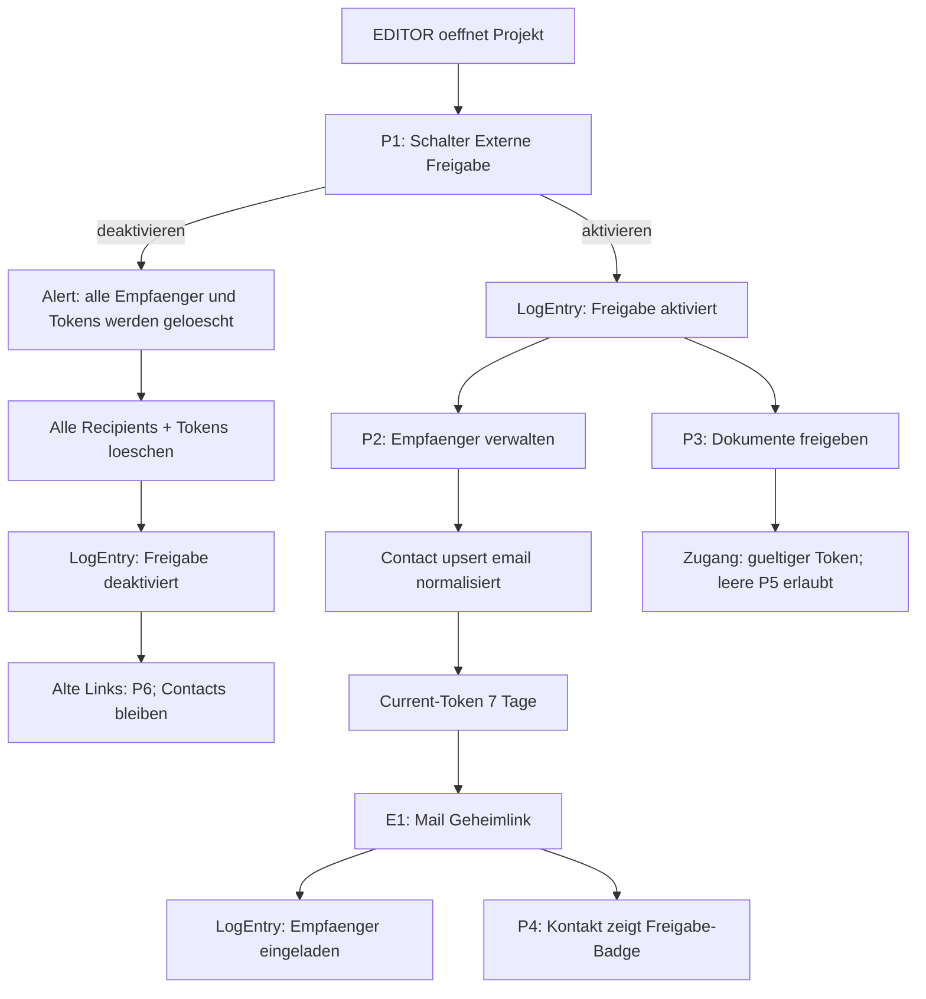
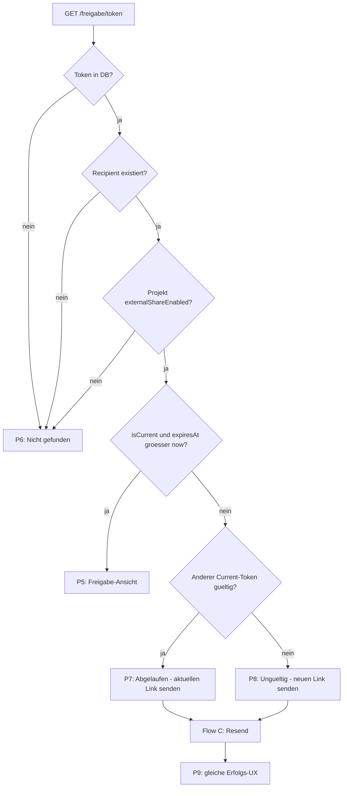
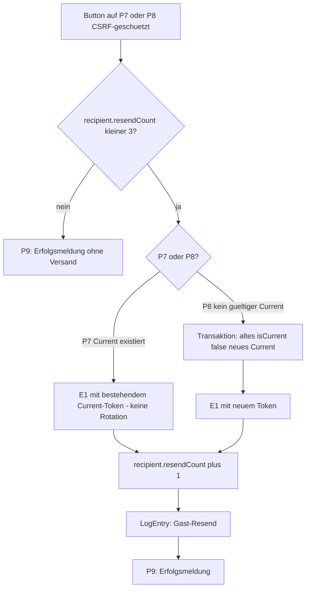
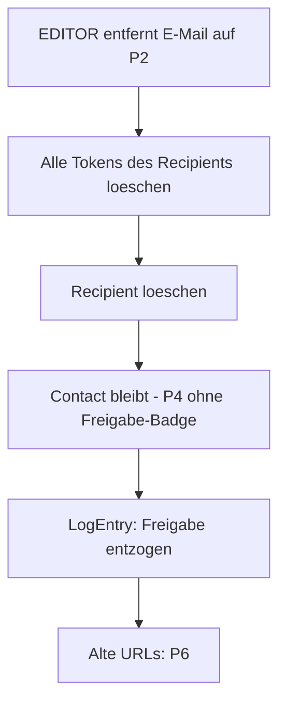
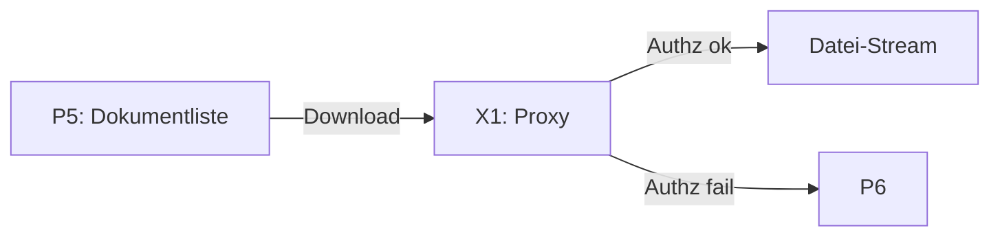
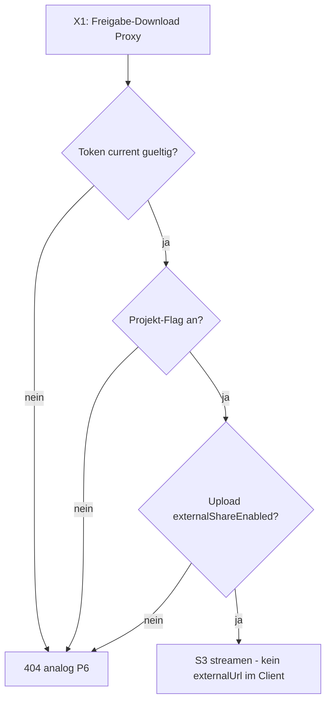
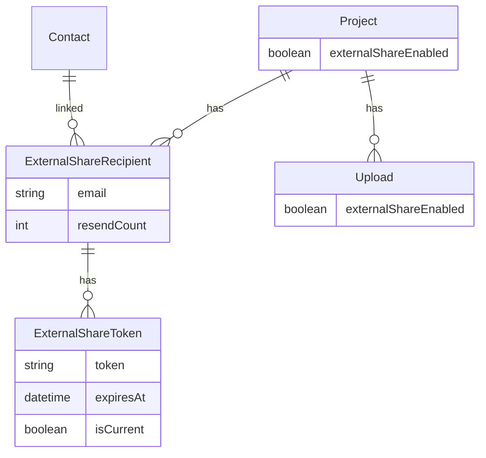

# Externe Freigabe (externalShare)

Ziel: Pro Projekt eine schlanke, freigeschaltete Ansicht für externe Personen, die keinen Trassenscout-Account brauchen. Projekt-Editoren entscheiden, ob die Funktion läuft, welche Dokumente sichtbar sind und wer per E-Mail einen Geheimlink bekommt. Externe sehen nur das bewusst Freigegebene — und im Produkt ist jederzeit nachvollziehbar, *was* geteilt wird.

## Benennung

Wir nennen die Funktion in der UI **Externe Freigabe**, im Code `externalShare` / `ExternalShare*`. Öffentliche URL: `/freigabe/$token`. Interne Verwaltung: `/$projectSlug/external-share`.

**Warum nicht „Kollaboration“?** Im Code existieren bereits `collaborationUrl` und `collaborationPath` für LuckyCloud-Dokumentenbearbeitung. Ein zweites „Kollaboration“ würde Editoren und Entwickler verwirren („Ist das die Freigabe-Seite oder der LuckyCloud-Link?“). „Externe Freigabe“ beschreibt klar: Zugang für Außenstehende, nicht gemeinsame Online-Bearbeitung.

## Was die Nutzer erleben (Überblick)

**Projekt-Editor** schaltet die Externe Freigabe für das Projekt ein, markiert einzelne Dokumente als geteilt, trägt E-Mail-Adressen ein und sieht eine Vorschau genau der Daten, die Externe sehen. Pro Adresse gibt es einen Indikator, ob gerade ein gültiger Link existiert. VIEWER dürfen dieselbe Verwaltungsseite **nur lesen** (Empfänger und Link-Status sehen, nichts ändern). Die Empfängerliste ist **nicht** für andere Freigabe-Halter (externe Personen) sichtbar — nur für Projekt-VIEWER und -EDITOR.

**Externe Person** erhält eine E-Mail mit Geheimlink (7 Tage gültig), öffnet die Freigabe-Ansicht ohne Login und kann freigegebene Dokumente ansehen/herunterladen. Typische Journey: E1 → P5 (bis zu 7 Tage) → nach Ablauf alter Link → P7 oder P8 → erneut E1 → wieder P5. Eine leere Freigabe-Seite (Token gültig, noch keine Dokumente) ist erlaubt und unproblematisch.

**Kontaktliste** zeigt weiterhin die Person als externen Kontakt; zusätzlich ist erkennbar, dass sie mit der Externen Freigabe verknüpft ist. Entzieht man den Zugang (einzelner Empfänger oder Projekt-Flag aus), bleibt der Kontakt erhalten (Adressbuch bleibt sauber), alle Tokens sind weg, der Link liefert sofort 404.

## Entscheidungen (fest)

Diese Punkte sind Produkt-/Security-Entscheidungen, die UX und Technik gemeinsam prägen:

- **Rechte:** `EDITOR` schaltet `project.externalShareEnabled` ein/aus und sieht das im User-facing-Protokoll (`LogEntry`). Derselbe EDITOR markiert Dokumente als freigegeben. `VIEWER` darf P2 und Empfängerliste lesen, aber nicht mutieren. Externe Freigabe-Halter sehen die Empfängerliste nie. Kein Superadmin-only-Gate.
- **v1-Objekte:** Nur Dokumente (`Upload`). Die Allowlist ist erweiterbar für spätere Objekttypen.
- **Token:** Klartext in der DB (wie bei Einladungen), inkl. historischer Tokens. Nur der **aktuelle, nicht abgelaufene** Token öffnet die Seite. Alte Tokens sind reine Resend-Handles.
  - **P7** (alter Link, aber gültiger Current existiert): aktuellen Link **erneut mailen**, **keine Rotation**.
  - **P8** (kein gültiger Current): **neuen** Current-Token erzeugen, alten behalten als Historie, dann mailen.
- **Genau ein Current:** Pro Recipient höchstens ein `isCurrent=true` — erzwungen in einer Transaktion (alle anderen `isCurrent=false`, dann neuer Current). Partial Unique Index wo Postgres es hergibt, sonst strikte Server-Invariante + Tests.
- **Gültigkeit:** 7 Tage global. Server setzt `expiresAt`; UI zeigt nur den abgeleiteten Status.
- **Resend-Schutz (einfach & eng genug):** Zähler `resendCount` am **Recipient** (nicht pro Token). Max. **3** erfolgreiche Resend-Mails pro Empfänger (egal über welchen alten Link). Erstversand durch EDITOR zählt nicht. Nach Limit: dieselbe Erfolgsmeldung wie bei Versand, aber kein weiterer Versand (kein Hinweis auf Limit). Speichern: ein Int-Feld am Recipient — simpel und begrenzt Spam auch bei vielen alten Links.
- **E-Mail-Normalisierung:** Vor jedem Upsert `trim` + `toLowerCase`. Unique auf normalisierter Form.
- **Kontakte:** Empfänger als `Contact` upserten; bestehende bleiben. Relation Recipient↔Contact. Herkunft/Entzug über Logs.
- **Downloads (X1):** Eigene oder erweiterte Proxy-Route. Nie S3-`externalUrl` an den Client. Authz = gültiger Current-Token + Projekt-Flag + `upload.externalShareEnabled`.
- **Bekannte v1-Einschränkung:** Download-URLs können den Token in der URL tragen (Referer, History, Logs). Bewusst wie Drive-Share; später Cookie-Session möglich (FYI).
- **Projekt-Flag aus:** Alert vor dem Deaktivieren: alle Empfänger und alle Tokens werden gelöscht; Kontakte bleiben als externe Kontakte ohne Zugang und müssen danach neu verknüpft werden. Danach: jeder alte Link → P6.
- **Öffentlicher Resend:** CSRF-Schutz Pflicht (Same-Origin + Token im Path / Origin-Check). Gast-Resend erzeugt user-facing `LogEntry` für Editoren.
- **Editor-Vorschau:** Nur session-basiert (eingeloggt). Kein Preview-Token ohne Empfänger. Öffentliche Seite funktioniert nur mit existierendem Token↔Recipient; Empfänger löschen bzw. Flag aus löscht alle Tokens → P6.
- **Optional später (FYI):** Token gegen kurzlebige Cookie-Session eintauschen — nicht v1.

## Datenmodell — und was das für die UX bedeutet

Technisch hängen wir an [`prisma/schema.prisma`](prisma/schema.prisma) an. Für Editoren übersetzt sich das so:

| Konzept | Was die Nutzerin merkt |
|---------|------------------------|
| `Project.externalShareEnabled` | Großer Schalter. Aus = Empfänger+Tokens weg, Alert vorher, öffentliche Requests → P6. |
| `Upload.externalShareEnabled` | Pro Dokument: „Auf der Externen Freigabe zeigen“. |
| `ExternalShareRecipient` | Zeile in der Empfängerliste (eine normalisierte E-Mail pro Projekt); trägt `resendCount`. |
| `ExternalShareToken` | Geheimlink. UI zeigt nur Status. Historie für Resend-Handles, nicht als Admin-Liste. |
| Relation zu `Contact` | Badge „Externe Freigabe“; Löschen aus Freigabe löscht nicht den Kontakt. |

```prisma
// Project
externalShareEnabled Boolean @default(false)

// Upload
externalShareEnabled Boolean @default(false)

model ExternalShareRecipient {
  id          Int      @id @default(autoincrement())
  createdAt   DateTime @default(now())
  updatedAt   DateTime @updatedAt
  email       String   // immer trim + lowercase
  resendCount Int      @default(0) // öffentliche Resends; max 3
  projectId   Int
  project     Project  @relation(...)
  contactId   Int
  contact     Contact  @relation(...)
  tokens      ExternalShareToken[]
  @@unique([projectId, email])
}

model ExternalShareToken {
  id          Int       @id @default(autoincrement())
  createdAt   DateTime  @default(now())
  token       String    @unique
  expiresAt   DateTime
  isCurrent   Boolean   @default(true)
  recipientId Int
  recipient   ExternalShareRecipient @relation(...)
  @@index([recipientId, isCurrent])
  // Invariante: pro recipientId höchstens ein isCurrent=true (Transaktion + Tests;
  // optional partial unique index WHERE isCurrent = true)
}
```

**Lebenszyklus in Nutzersprache:**

- E-Mail hinzufügen (normalisiert) → Kontakt upsert → Current-Token → E1 → Status „gültiger Link“.
- Alter Link, Current noch gültig (P7) → Button → E1 mit **demselben** Current-Token → `resendCount++`.
- Alter Link, kein gültiger Current (P8) → Button → neuer Current → E1 → `resendCount++`.
- Einzelnen Empfänger entfernen → Recipient+Tokens weg, Contact bleibt.
- Projekt-Flag aus → Alert → **alle** Recipients+Tokens weg, Contacts bleiben → Re-Enable startet bei null Empfängern.

## Allowlist — warum, Vorteil, wie es wirkt

### Warum wir das brauchen

Sobald etwas „nach draußen“ geht, stellen Editoren (und später Audit/Support) immer dieselbe Frage: *Welche Felder und Aktionen sieht eine externe Person wirklich?* Ohne feste Liste driftet die Antwort zwischen Vorschau, API und Detailseite. Die Allowlist verhindert das.

### Vorteil für die UX

1. **Vertrauen beim Teilen:** Am Dokument und auf P2 steht in Klartext, was veröffentlicht wird — und was nicht.
2. **Eine Wahrheit:** Admin-Vorschau, öffentliche Seite und Download-API lesen dieselbe Config.
3. **Ruhige Weiterentwicklung:** Neue Upload-Felder sind standardmäßig nicht öffentlich.

### Wie es funktioniert

Zentrale Config z. B. [`src/shared/externalShare/uploadAllowlist.ts`](src/shared/externalShare/uploadAllowlist.ts): erlaubte Felder (`title`, `summary`, `mimeType`, …) und Aktionen (`view`, `download`). Speist Transparenz am Objekt, Admin-Vorschau und Server-Selects/Proxy.

## UI / Routes — interne und öffentliche Erfahrung

### Intern (eingeloggt)

**Schalter am Projekt (P1):** EDITOR schaltet ein/aus. Beim **Deaktivieren** Confirm-Alert, z. B.: „Wenn Sie die Externe Freigabe deaktivieren, werden alle N Empfänger entkoppelt und ihre Links ungültig. Die Adressen bleiben als externe Kontakte erhalten, haben aber keinen Zugang mehr und müssen danach neu verknüpft werden.“ Umschalten und Massen-Entzug → `LogEntry`.

**Seite „Externe Freigabe“ (P2):**

- VIEWER: Lesemodus (Empfänger, Link-Status, Vorschau „was geht raus“).
- EDITOR: Empfänger add/remove, Status gültig/abgelaufen/keiner. Keine Token-Strings in der UI.
- Editor-Vorschau der öffentlichen Ansicht: **nur über Session** (gleiche Allowlist-Daten), kein Geheim-Token ohne Empfänger.

**Dokumente (P3):** Checkbox „In Externer Freigabe teilen“ + Allowlist-Transparenz; nur wenn Projekt-Flag an.

**Kontakte (P4):** Badge wenn Recipient-Relation existiert.

### Öffentlich

Route `/freigabe/$token` ohne Login, `Cache-Control: no-store`.

| Situation | Seite | Copy (Kern) |
|-----------|-------|-------------|
| Gültiger Current, Flag an | **P5** | Freigabe-Ansicht (auch leer, falls noch keine Dokumente) |
| Token unbekannt / Empfänger weg / Flag aus | **P6** | Generische 404 |
| Token bekannt, abgelaufen, Current noch gültig | **P7** | „Dieser Link ist abgelaufen. Wir können Ihnen den **aktuellen** Link erneut senden.“ + maskierte Mail + Button |
| Token bekannt, abgelaufen, kein gültiger Current | **P8** | „Dieser Link ist nicht mehr gültig. Wir können Ihnen einen **neuen** Link senden.“ + maskierte Mail + Button |
| Nach Resend-Action (versendet oder Limit) | **P9** | Immer dieselbe Erfolgsmeldung („E-Mail wurde gesendet“). Limit wird **nicht** kommuniziert — P10 ist nur interne Logik-ID, gleiche UX wie P9. |

## Mail — Einladung und erneuter Versand

Neues Registry-Template **E1** `external_share_link_user` für Erstversand und Resend. Absolute Links via `mailUrl.ts`. Keine Extra-Mail an Editoren (UI + Logs reichen).

## E-Mail-Masking auf der öffentlichen Seite

Feste Util-Regel (Local-Part und Domain-Label vor TLD):

- Sichtbare Präfixlänge: `max(1, min(3, floor(len * 0.3)))` Zeichen, Rest `***` (mindestens ein Stern-Block).
- Beispiel grob: `ab@xy.de` → `a***@x***.de`; `alexander@beispielstadt.de` → `ale***@bei***.de`.
- Volle Adresse nie im öffentlichen HTML / öffentlichen Logs.

## Geheimlink und Token-Verhalten (UX)

7-Tage-Link = teilbare Capability-URL (Drive-Modell). Alte Tokens öffnen nie P5; nur Resend über P7/P8. Resend max. 3× pro Recipient (`resendCount`); danach gleiche Erfolgs-UX ohne Versand.

---

## E-Mails und Templates (Bestand + neu)

### Bestehende Registry-Templates ([`src/shared/emailTemplates/registry.ts`](src/shared/emailTemplates/registry.ts))

| Key | Name (Admin) | An wen | CTA |
|-----|--------------|--------|-----|
| `forgot_password` | Passwort zurücksetzen | Nutzer:in | ja |
| `invitation_created_user` | Einladung an Mitwirkende | Eingeladene Person | ja |
| `invitation_created_editors_notification` | Info an Editoren: Einladung erstellt | Projekt-Editoren | nein |
| `membership_created_editors_notification` | Info an Editoren: Einladung angenommen | Projekt-Editoren | nein |
| `project_record_assigned_user` | Protokolleintrag: Zuweisung | Zugewiesene Person | ja |
| `project_record_email_without_project_admin` | Admin: E-Mail keinem Projekt zugeordnet | Trassenscout-Admins | ja |
| `project_record_legacy_mailbox_moved_sender` | Absender: Legacy-Protokoll-Postfach umgezogen | Absender | nein |
| `project_record_needs_review_admin` | Admin: E-Mail braucht Prüfung | Trassenscout-Admins | ja |
| `user_created_admin_notification` | Admin: Nutzerkonto erstellt | Trassenscout-Admins | ja |
| `user_created_user_notification` | Info an Nutzer:in: Account erstellt | Neue:r Nutzer:in | ja |

### Außerhalb der Registry

| Mailer | Zweck |
|--------|--------|
| [`surveyEntryCreatedNotificationToUser.tsx`](emails/mailers/surveyEntryCreatedNotificationToUser.tsx) | Beteiligung-Bestätigung (Survey-Config) |

### Neu

| ID | Key | Name | Wann |
|----|-----|------|------|
| **E1** | `external_share_link_user` | Externe Freigabe: Geheimlink | Empfänger anlegen + erfolgreicher Resend (P7/P8) |

Mailer: `emails/mailers/externalShareLinkMailToUser.tsx`. CTA „Freigabe öffnen“.

## Seitenkatalog (mit IDs für die Flowcharts)

### Intern

| ID | Seite | Route (Vorschlag) | Wer | Zweck / UX |
|----|-------|-------------------|-----|------------|
| **P1** | Schalter + Deactivate-Alert | `/$projectSlug/edit` o.ä. | EDITOR | Ein/Aus; Aus löscht alle Recipients+Tokens |
| **P2** | Externe Freigabe verwalten | `/$projectSlug/external-share` | VIEWER lesen / EDITOR schreiben | Empfänger, Status, Allowlist-Vorschau; Empfängerliste nicht für Externe |
| **P3** | Dokument freigeben | Upload-Edit/Detail | EDITOR | Checkbox + Transparenz |
| **P4** | Kontakt-Badge | `/$projectSlug/contacts` | VIEWER/EDITOR | Hinweis „Externe Freigabe“ |

### Öffentlich

| ID | Zustand | Zweck / UX |
|----|---------|------------|
| **P5** | Freigabe-Ansicht | Allowlist-Daten; Download via X1; leere Liste ok |
| **P6** | Nicht gefunden | Unbekannt / Empfänger weg / Flag aus |
| **P7** | Abgelaufen → aktuellen Link senden | Keine Token-Rotation |
| **P8** | Ungültig → neuen Link senden | Token-Rotation |
| **P9** | Resend-Feedback | Immer gleiche Erfolgsmeldung (auch wenn Limit greift) |
| **P10** | Limit (intern) | Kein eigener sichtbarer Screen — gleiche UX wie P9, kein Versand |

| ID | Endpoint | Zweck |
|----|----------|--------|
| **X1** | Freigabe-Download-Proxy | Stream; Fail → 404 wie P6. **v1:** Token ggf. in Download-URL (Referer/History/Logs) — bekannte Einschränkung. |

---

## Ablaufdiagramme

### A) EDITOR: Freigabe einrichten / abschalten



### B) Öffentlicher Aufruf Geheimlink



### C) Resend (P7 vs P8 getrennt)



Wichtig: Alte Tokens **öffnen nie** P5. P7 mailt den bestehenden Current; P8 rotiert atomar (genau ein Current).

### D) Einzelnen Empfänger entfernen



### E) Dokument-Download (P5 → X1)





Hinweis v1: Token kann in der Download-URL stehen (Referer/History/Logs) — akzeptierte Einschränkung des Drive-Modells.

### F) Domänenmodell (Überblick)



---

## Umsetzungsschritte (Code)

1. **Prisma:** Felder + Modelle + Migration; `resendCount` am Recipient; Invariante ein Current pro Recipient; Client regenerieren.
2. **Settings/Utils:** 7d-Konstante, Masking-Util (Formel oben), Allowlist, E-Mail-Normalisierung, `generateSecureToken`.
3. **Server:** CRUD Empfänger; P7 ohne Rotation / P8 mit Rotation in Transaktion; Resend-Limit am Recipient; CSRF für Resend; Resolve-Logik; Download-Proxy.
4. **Mail:** E1 Template + Mailer.
5. **UI intern:** P1 mit Deactivate-Alert (Empfänger+Tokens löschen), P2 Lesen/Schreiben, Session-Preview, P3, P4.
6. **UI öffentlich:** P5–P9 (P10 nur Logik), `no-store`, Copy P7/P8.
7. **Cron:** sehr alte Non-Current-Tokens aufräumen.
8. **Logs:** Flag-Toggle, Empfänger add/remove, **Gast-Resend** (user-facing).
9. **Tests:** Token-Zustände, Doppelklick/Parallel-Resend (ein Current), Limit, Flag-aus-Wipe, E-Mail-Normalisierung, Download-Authz, CSRF.

## Optional FYI (nicht v1) — stärkere Auth

Token gegen HttpOnly-Session eintauschen (Assets ohne Token in der URL) oder Magic-Confirm per E-Mail. Bewusst zurückgestellt — v1 ist die teilbare 7-Tage-URL inkl. bekannter Token-in-URL-Einschränkung bei Downloads.
