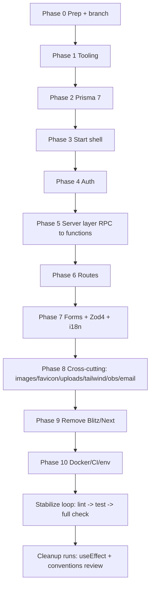

# TanStack Start Migration Plan

In-place migration of Trassenscout (Blitz 2 / Next 14 / npm / Prisma 5) to TanStack Start (Vite + Nitro) / Bun / Prisma 7 / Better Auth, aligned with `tilda-geo`.

## Ground rules (apply to every step)

- **One WIP commit per step.** Message format `WIP migrate <what>` (e.g. `WIP migrate tooling to oxlint/oxfmt`). Lint/format/type-clean is NOT required for WIP commits — commit to keep the pending diff small.
- **Branch:** do all work on a dedicated long-lived branch (e.g. `migrate/tanstack-start`); never WIP-commit to `main`/`develop`.
- **Required reading per phase:** each phase below names the `_migration/*.md` doc(s) that are the authoritative spec. Read the doc, follow it, treat its checklist as the source of truth. Skills back the general patterns: [tanstack-start-migration](.agents/skills/tanstack-start-migration/SKILL.md), [tanstack-start-app-structure](.agents/skills/tanstack-start-app-structure/SKILL.md), [tanstack-start-conventions](.agents/skills/tanstack-start-conventions/SKILL.md), [tanstack-start-auth](.agents/skills/tanstack-start-auth/SKILL.md).
- **Verify before claiming done:** after each phase run the narrowest check that proves it (`type-check`, targeted test, `bun run dev` hard-refresh + client-nav of the touched route). Do not mark a step complete on assertion alone.
- **Critical mental model (from the migration skill):** TanStack Start is **isomorphic by default** — loaders/components run on server AND client. All DB/secret/fs access goes through `createServerFn` (`*.functions.ts`) or `createServerOnlyFn` (`*.server.ts`). Route files stay thin: `Route` config + one `@/components/...` import. Remove every `"use server"` / `"use client"`.

## Strategy: critical-path first, then stabilize, then clean up

Phases 1–6 are the **critical path** (app must boot and authenticate). Phases 7–10 are breadth. The **stabilize loop** and **cleanup runs** run only after the app builds and the critical routes work.

---

## Phase 0 — Prep

- Create branch `migrate/tanstack-start`.
- Add a top-level `_migration/README.md` index mapping each doc to its phase below (doc map + this workflow), so any agent picking up a phase knows its spec.
- Confirm `tilda-geo/app` is checked out as a sibling (all docs reference `../../tilda-geo/app`).
- Commit: `WIP migrate add migration index and branch setup`.

## Phase 1 — Tooling (Bun + oxlint + oxfmt)

Spec: [tooling.md](_migration/tooling.md), [package-script-names.md](_migration/package-script-names.md), [_migration/oxlint.config.mjs](_migration/oxlint.config.mjs).

- Switch npm → Bun (`bun.lock`), add `oxfmt.config.ts` + `oxlint.config.mjs` (required rule `typescript/switch-exhaustiveness-check: error`), remove ESLint + Prettier configs/deps.
- Rename scripts to the kebab convention (`type-check`, `migrate-create`, …) per `package-script-names.md`.
- Husky: add pre-commit format, pre-push full `check`.
- Can land on the still-Blitz tree first (adjust `ignorePatterns` for `.next/**`, generated route tree later).
- Commit: `WIP migrate tooling to bun/oxlint/oxfmt`.

## Phase 2 — Prisma 7

Spec: [db-migration.md](_migration/db-migration.md), rule [base.mdc](.cursor/rules/base.mdc).

- Move `db/` → `prisma/`, `prisma-client-js` → `prisma-client` generator, add `prisma.config.ts`, `@prisma/adapter-pg` + `pg`, ESM client output.
- Decide schema namespace (doc recommends staying on `public` unless geo tables added).
- Migrate remote-DB tooling (`db/remote/*`) script invocations to `bun prisma …`.
- Verify: `prisma generate`, `migrate status`, restore-local flow.
- Commit: `WIP migrate prisma 7 + adapter-pg`.

## Phase 3 — TanStack Start shell

Spec: migration skill §1–2, [app-structure](.agents/skills/tanstack-start-app-structure/SKILL.md), [new-tailwind.md](_migration/new-tailwind.md), [favicon.md](_migration/favicon.md), [env-check.md](_migration/env-check.md).

- Install `@tanstack/react-start`, `@tanstack/react-router`, `@tanstack/react-query`, `vite`, `nitro`, router plugin; remove Vinxi/`@tanstack/start` if present.
- Add `vite.config.ts` (tanstackStart before viteReact, `@tailwindcss/vite`, nitro, port 4000), `src/router.tsx`, `src/routes/__root.tsx` with `<HeadContent/>`/`<Scripts/>`/`<Outlet/>`.
- Wire Tailwind v4 through Vite (relocate `global.css`, `?url` import in `__root.tsx`), drop autoprefixer/PostCSS baggage.
- React 18 → 19, enable React Compiler (Babel plugin + oxlint jsPlugin).
- `NEXT_PUBLIC_*` → `VITE_*`; add Zod env schema + Nitro env-validation plugin.
- Goal: empty app boots on `bun run dev`. Commit: `WIP migrate tanstack start shell + tailwind + react19`.

## Phase 4 — Auth (Better Auth)

Spec: [auth.md](_migration/auth.md), [tanstack-start-auth](.agents/skills/tanstack-start-auth/SKILL.md), [better-auth-config.md](.agents/skills/tanstack-start-auth/references/better-auth-config.md).

- `auth.server.ts` (email/password + `customSessionWithRole`), `createAuthClient`, `/api/auth/$` → `forwardAuthAndApplyCookies` (NO `tanstackStartCookies`), `session.server.ts` helpers taking `Headers`.
- Schema: add `Account`, `emailVerified`, `passwordResetRequired`, `passwordHashMigratedAt`; keep Blitz tables until cutover.
- Password strategy: lazy rehash for active cohort (5-month window) + `passwordResetRequired` for inactive (no bulk email) — per doc's decided strategy. Spike Blitz `SecurePassword.verify` first.
- Invite flow preserved as custom server fn.
- Commit: `WIP migrate auth to better-auth`.

## Phase 5 — Server layer (Blitz RPC → server functions)

Spec: [db-migration.md](_migration/db-migration.md) (server layer), [conventions](.agents/skills/tanstack-start-conventions/SKILL.md) → [client-server-boundaries.md](.agents/skills/tanstack-start-conventions/references/client-server-boundaries.md), [server-functions.md](.agents/skills/tanstack-start-migration/references/server-functions.md).

- Port ~180+ resolvers to `src/server/<domain>/*.functions.ts` (`createServerFn` + `inputValidator`) + `*.server.ts` for DB/session, `*QueryOptions` for reads.
- Authorization helpers: `authorizeProjectMember` → `authorizeProjectMemberByProjectSlug(session, slug, roles)`; API-key `withApiKey` → timing-safe compare.
- **Batch by domain** (auth → projects → memberships → subsections → uploads → surveys → …) — one WIP commit per domain batch: `WIP migrate server <domain> to functions`.

## Phase 6 — Routes

Spec: [routes.md](_migration/routes.md), migration skill §2/§5, [params-search-ui-vs-api.md](.agents/skills/tanstack-start-conventions/references/params-search-ui-vs-api.md), [selective-ssr.md](.agents/skills/tanstack-start-conventions/references/selective-ssr.md).

- App Router pages → `src/routes/` file routes (`[param]` → `$param`, `[[...]]` → `$`), thin routes + `components/` Layout*/Page* split.
- Loaders prime Query cache (`ensureQueryData`) + `useSuspenseQuery`; auth via `beforeLoad`; set `ssr` explicitly per route.
- API routes → `routes/api/*.ts` `server.handlers` (Zod `safeParse` from `request.url`, no `validateSearch`).
- Parallel routes / modals (upload edit `@modal`) redesigned per doc.
- Commit per route group: `WIP migrate routes <group>`.

## Phase 7 — Forms + Zod 4 + i18n

Spec: [new-zod.md](_migration/new-zod.md), [new-i18n.md](_migration/new-i18n.md), tech-stack forms note.

- Zod 3 → 4 across ~231 files (`.merge()`→`.extend()`, `z.url()/z.email()`, `z.enum(PrismaEnum)`, `z.flattenError`), `z.config(de())` locale.
- `react-hook-form` → `@tanstack/react-form` (schema as validator), per feature area.
- `react-intl` 7 → 10 (2 files; unblocked by React 19).
- Commit per area: `WIP migrate forms+zod <area>`.

## Phase 8 — Cross-cutting product surfaces

Specs: [images.md](_migration/images.md), [favicon.md](_migration/favicon.md), [uploads.md](_migration/uploads.md), [observability.md](_migration/observability.md), [new-tailwind.md](_migration/new-tailwind.md), email/PDF notes in [tech-stack-migration.md](_migration/tech-stack-migration.md).

- Images: `next/image` → `Img`/`` + Vite imports; delete `next.config.js` `remotePatterns`/`domains`.
- Favicon: single `public/favicon.svg` + ported generate-favicons script + `__root.tsx` head links.
- Uploads: keep `@better-upload`; swap Next adapter → `handleRequest` in `server.handlers.POST`; post-upload writes via `uploads.functions.ts`.
- Observability: drop `@vercel/otel`/`langfuse-vercel` → `@opentelemetry/sdk-node` + `@langfuse/otel` Nitro plugin; service name `trassenscout`.
- PDF worker under Vite static assets.
- Commit per surface: `WIP migrate <surface>`.

## Phase 9 — Remove Blitz/Next

Spec: [tech-stack-migration.md](_migration/tech-stack-migration.md) (Packages to remove), [auth.md](_migration/auth.md) (files to remove).

- Delete `blitz`, `@blitzjs/*`, `next`, `eslint-config-next`, `next-router-mock`, RHF packages, Blitz auth/config files, `src/app/`, `pages/api/rpc`.
- Remove all `"use server"`/`"use client"`; confirm no `next/*` imports remain.
- Commit: `WIP migrate remove blitz/next`.

## Phase 10 — Docker / CI / deploy / env

Spec: [docker.md](_migration/docker.md), [env-check.md](_migration/env-check.md), [tooling.md](_migration/tooling.md) §10–11, [testing.md](_migration/testing.md) (CI).

- `app.Dockerfile`: `oven/bun:1`, `bun run build` → `.output`, `bunx prisma migrate deploy && bun .output/server/index.mjs`, port 4000, `gdal-bin`+`curl` (no GDAL version gate — TS only needs `ogr2ogr`).
- Add `ci.yml` (type-check / lint / test on PR); deploy env manifest + verify script.
- `imap-listener/`: Bunify / align env.
- Commit: `WIP migrate docker/ci/env`.

---

## Stabilize loop (after app builds + critical routes work)

Run in this order, each its own WIP commit:

1. `bun run lint` (oxlint `--fix`) → fix remaining issues → `WIP migrate fix lint`.
2. `bun run test-run` (Vitest) → rewrite DB tests for Prisma 7 / Better Auth per [testing.md](_migration/testing.md) → `WIP migrate fix unit tests`.
3. E2E smoke (Playwright, stubbed auth) per [testing.md](_migration/testing.md) + [playwright-skill](.agents/skills/playwright-skill/SKILL.md) → `WIP migrate e2e smoke`.
4. Full `bun run check` (parallel type-check + lint + format + test) → `WIP migrate full check green`.

## Cleanup runs (separate review passes, only when migration works)

1. **useEffect pass:** full code review against [react-useeffect](.agents/skills/react-useeffect/SKILL.md) (+ [react-named-effects](.cursor/skills/react-named-effects/SKILL.md)) — remove unnecessary effects, name effects, fix derived-state/data-fetch anti-patterns. Commit per area.
2. **Conventions pass:** review whole codebase against [tanstack-start-conventions](.agents/skills/tanstack-start-conventions/SKILL.md) + [tanstack-start-app-structure](.agents/skills/tanstack-start-app-structure/SKILL.md) — thin routes, `.server.ts`/`.functions.ts` boundaries, loader-vs-Query, explicit `ssr`. Commit per area.
3. Final squash/cleanup of WIP commits into reviewable commits before opening the PR (history rewrite only on the migration branch, never shared `main`).

## What makes this agent-driven and clean (additional measures)

- **Per-phase contract:** each phase = read its `_migration` doc → implement → run the doc's checklist → verify command → WIP commit. The doc checklists are the acceptance criteria.
- **Parallel subagents** for independent breadth work (Phase 5 domain batches, Phase 8 surfaces, cleanup areas) once the shell + auth exist — see [dispatching-parallel-agents](.cursor/plugins/cache/cursor-public/superpowers/b7a8f76985f1e93e75dd2f2a3b424dc731bd9d37/skills/dispatching-parallel-agents/SKILL.md).
- **Tight verification gates** ([verification-before-completion](.cursor/plugins/cache/cursor-public/superpowers/b7a8f76985f1e93e75dd2f2a3b424dc731bd9d37/skills/verification-before-completion/SKILL.md)): no phase is "done" without `type-check` + targeted route smoke (hard refresh AND client nav, per the isomorphic mental model).
- **Migration progress tracker:** a checkbox table in `_migration/README.md` (RPC domains ported, route groups migrated, packages removed) updated as WIP commits land — gives any resuming agent a resumable state.
- **Code-review subagent** after critical path and again pre-PR (`code-reviewer`) against the plan + skills.
- **Dead-code sweep** with `knip` before final cleanup to catch orphaned Blitz/Next/RHF code.
- **Keep Blitz running until Phase 9** so the app is demoable throughout; the parallel route tree lets you migrate route-by-route without a big-bang cutover.
