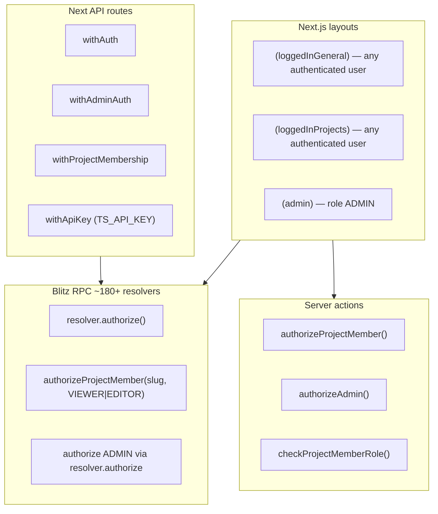

# Auth migration — Trassenscout → TanStack Start (TILDA-aligned)

Analysis date: 2026-06-04  
Reference: [`tilda-geo/app`](../../tilda-geo/app)  
Companion: [`tech-stack-migration.md`](./tech-stack-migration.md), [`db-migration.md`](./db-migration.md)

This document compares **Trassenscout auth today** (Blitz Auth, email/password, project memberships) with **TILDA Geo auth** (Better Auth, OSM OAuth only, region memberships), and defines what to migrate, what to align with TILDA, and what must stay product-specific.

**Assumption:** Trassenscout is migrated to **TanStack Start** as described in the companion docs. Auth work is a dedicated phase inside that migration, not a standalone swap.

---

## Executive summary

| Area              | Trassenscout today                                        | TILDA Geo (reference)                        | Trassenscout target                                                                      |
| ----------------- | --------------------------------------------------------- | -------------------------------------------- | ---------------------------------------------------------------------------------------- |
| Library           | `@blitzjs/auth` + `secure-password`                       | `better-auth` + Prisma adapter               | **better-auth** (align with TILDA)                                                       |
| Sign-in           | Email + password forms                                    | OSM OAuth only (`genericOAuth`)              | **Email + password** (product requirement)                                               |
| Session transport | Blitz cookie (`rsv-builder.*`)                            | Better Auth cookies (`tilda.*`)              | Better Auth cookies (`trassenscout.*` or similar)                                        |
| User PK           | `Int` autoincrement                                       | `String` `@default(cuid())`                  | **String cuid** (Better Auth + TILDA)                                                    |
| Session payload   | `userId`, `role`, **full `memberships[]`** in public data | `userId`, `role` only (customSession plugin) | **userId + role only** — drop memberships from session                                   |
| Membership auth   | Often from session; also fresh DB check in resolvers      | Always fresh DB check                        | **Always fresh DB check** (TILDA pattern)                                                |
| Route gates       | Next.js layout `useAuthenticatedBlitzContext`             | TanStack `beforeLoad` + server fns           | **beforeLoad** (TILDA pattern)                                                           |
| RPC/API auth      | `resolver.authorize`, `withAuth`, `withProjectMembership` | `requireAuth` / `requireAdmin` + headers     | **session.server.ts helpers + headers**                                                  |
| Password reset    | Blitz `Token` model + custom mailers                      | N/A (no passwords)                           | **better-auth `Verification`**; inactive users self-serve reset at login (no bulk email) |
| Invites           | Login/signup + `inviteToken` → create membership          | N/A                                          | **Keep** — custom flow on top of Better Auth                                             |
| Machine auth      | `TS_API_KEY` (plain string compare)                       | `ATLAS_API_KEY` (timing-safe)                | **Timing-safe compare** (align with TILDA)                                               |

**Bottom line:** Adopt TILDA’s **Better Auth infrastructure and authorization patterns**, but **not** OSM-only identity. Trassenscout remains an invite-driven, email/password B2B app with **project-scoped VIEWER/EDITOR roles**.

---

## Trassenscout auth today

### Stack and entry points

| File / area                   | Role                                                            |
| ----------------------------- | --------------------------------------------------------------- |
| `src/blitz-auth-config.ts`    | Cookie prefix `rsv-builder`                                     |
| `src/blitz-server.ts`         | `AuthServerPlugin` + `PrismaStorage`, `simpleRolesIsAuthorized` |
| `src/blitz-client.ts`         | Client auth plugin                                              |
| `types.ts`                    | Session `PublicData`: `userId`, `role`, `memberships[]`         |
| `src/server/auth/mutations/*` | login, signup, logout, forgot/reset/change password, updateUser |
| `src/server/auth/schema.ts`   | Zod schemas for auth forms                                      |
| `src/app/auth/*`              | Login, signup, forgot/reset password, logout pages              |
| `db/schema.prisma`            | `User`, `Session`, `Token` (Blitz shape)                        |

### Session model (Blitz-specific)

On login/signup, the app calls `ctx.session.$create({ userId, role, memberships })` where `memberships` includes `{ role, project: { id, slug } }` for every project the user belongs to.

That cached membership list is used client-side (e.g. `CurrentUserCanIcon` reads `session.memberships`). Server resolvers **also** re-query the DB in `authorizeProjectMember` — session data is not fully trusted for writes, but UI convenience depends on it.

When membership roles change, `membershipUpdateSession` either updates the current user’s session (`$setPublicData`) or deletes all sessions for the affected user.

### Authorization layers



**Important gap today:** `(loggedInProjects)/layout.tsx` only checks “logged in”, not “member of `[projectSlug]`”. Project access is enforced per RPC/action/API call. That stays conceptually the same in the target (like TILDA’s region page: layout/route may allow entry, authorization is explicit).

### Product flows to preserve

1. **Signup** — email, password, profile fields, optional invite → creates user + optional membership.
2. **Login** — email/password, optional `inviteToken` → accepts invite, creates membership, notifications.
3. **Forgot / reset password** — Blitz token in `Token` table, 4h expiry, email via Brevo.
4. **Change password** — authenticated, verifies current password via `SecurePassword`.
5. **Invites** — pending invite by email + token; consumed on login/signup (`updateInvite`).
6. **Admin** — global `UserRoleEnum.ADMIN` bypasses project membership checks.
7. **Project roles** — `VIEWER` vs `EDITOR` on `Membership` (TILDA has membership without roles).

### Password hashing

Blitz `SecurePassword` (bcrypt-based, with rehash-on-login for `VALID_NEEDS_REHASH`). Hashes live in `User.hashedPassword`.

---

## TILDA auth (reference)

Primary doc: [`tilda-geo/docs/TanStack-Start-Auth.md`](../../tilda-geo/docs/TanStack-Start-Auth.md)

### Stack

| File                                           | Role                                                                            |
| ---------------------------------------------- | ------------------------------------------------------------------------------- |
| `src/server/auth/auth.server.ts`               | `betterAuth()` — Prisma adapter, OSM `genericOAuth`, `customSession` for `role` |
| `src/server/auth/session.server.ts`            | `getSession`, `getFreshSession`, `getAppSession`, `requireAuth`, `requireAdmin` |
| `src/server/auth/auth-route-handler.server.ts` | `forwardAuthAndApplyCookies` — **no** `tanstackStartCookies` (Vite client leak) |
| `src/components/shared/auth/auth-client.ts`    | `createAuthClient` + plugins                                                    |
| `src/routes/api/auth.$.ts`                     | Catch-all Better Auth handler                                                   |
| `src/routes/api/sign-in.osm.ts`                | OAuth entry with safe `callbackURL`                                             |
| `src/routes/oAuthError.tsx`                    | User-facing OAuth errors                                                        |

### Design choices worth copying

1. **Headers everywhere** — session helpers take `headers: Headers`; server fns use `getRequestHeaders()`.
2. **`beforeLoad`, not middleware** — auth gates live on route definitions; see `admin.tsx`, `regionen/$regionSlug.tsx`.
3. **No memberships in session** — authorization always hits DB (`checkRegionAuthorization`, `authorizeRegionMember`).
4. **`getFreshSession` for admin** — disables cookie cache when checking admin role.
5. **Manual cookie forwarding** — avoids bundling `@tanstack/react-start/server` into client via Better Auth’s TanStack helper.
6. **Safe OAuth callback URLs** — origin check + relative path normalization (`sign-in.osm.ts`).
7. **API route auth per handler** — no router-level API middleware.
8. **Timing-safe API key compare** — `compareApiKeyTimingSafe` for `ATLAS_API_KEY`.
9. **E2E auth** — real OSM login setup + stubbed cookie sessions for CI (`tests/fixtures/auth.ts`).

### TILDA schema (auth-related)

- `User`: String `id`, `email`, `emailVerified`, OSM fields (`osmId`, `osmName`, …), `role`
- `Session`, `Account`, `Verification` — Better Auth standard tables
- `Membership`: user ↔ region, **no role enum**
- Legacy `Token` model still exists for non-auth features

### What TILDA does **not** provide for Trassenscout

- Email/password sign-in (explicitly `emailAndPassword.enabled: false`)
- Invite-on-signup flow
- Password reset emails
- Project-level VIEWER/EDITOR roles
- Session membership cache for UI

---

## Side-by-side comparison

### Identity & credentials

| Concern               | Trassenscout         | TILDA                                        |
| --------------------- | -------------------- | -------------------------------------------- |
| Primary IdP           | Email (unique login) | OSM user id                                  |
| Password              | Required             | None                                         |
| Email source          | User registration    | Placeholder `@users.openstreetmap.invalid`   |
| Account linking       | N/A                  | `Account` row, provider `osm`                |
| New user notification | Admin + user emails  | `sendNewUserRegistration` on first OSM login |

### Session & cookies

| Concern              | Trassenscout                         | TILDA                                |
| -------------------- | ------------------------------------ | ------------------------------------ |
| Storage              | Blitz `Session` + hashed token in DB | Better Auth `Session` + cookie cache |
| Cookie prefix        | `rsv-builder`                        | `tilda`                              |
| Client hook          | `useSession()` from `@blitzjs/auth`  | `authClient.useSession()`            |
| Extra session fields | `memberships[]`                      | `role` via `customSession` plugin    |
| Logout               | Blitz logout mutation                | `authClient.signOut()`               |

### Authorization model

| Concern             | Trassenscout                        | TILDA                                |
| ------------------- | ----------------------------------- | ------------------------------------ |
| Resource            | `Project` by `projectSlug`          | `Region` by `regionSlug`             |
| Public access       | Must be logged in for app areas     | `RegionStatus.PUBLIC` — anonymous OK |
| Membership          | Required for all projects (via RPC) | Required only for `PRIVATE` regions  |
| Roles               | `VIEWER`, `EDITOR`                  | None (member or not)                 |
| Admin bypass        | Yes                                 | Yes                                  |
| Client role display | From session memberships            | From `useSession` + server checks    |

---

## Target architecture (TanStack Start)

### File layout (mirror TILDA, Trassenscout names)

```
src/
  server/auth/
    auth.server.ts              # betterAuth config (email/password + customSession)
    session.server.ts           # getSession, getAppSession, requireAuth, requireAdmin
    auth-route-handler.server.ts
    auth.functions.ts           # getRedirectCookieFn, getIsAdminFn, …
    errors.ts
    types.ts                    # AppSession
    cookieName.const.ts
  components/shared/auth/
    auth-client.ts
  routes/
    api/auth.$.ts               # Better Auth catch-all
    auth/
      login.tsx                 # was app/auth/login
      signup.tsx
      forgot-password.tsx
      reset-password.tsx
      logout.tsx
    admin.tsx                   # beforeLoad: admin gate
    $projectSlug.tsx            # or layout route — beforeLoad: project auth context
  server/authorization/
    checkProjectAuthorization.server.ts
    authorizeProjectMember.server.ts
    authGuards.server.ts        # guardAdmin, guardProjectMembership (API routes)
```

### Target `auth.server.ts` shape

Align with TILDA’s structure; **enable email/password** instead of OSM OAuth:

```typescript
// Conceptual — not final implementation
betterAuth({
  database: prismaAdapter(db, { provider: "postgresql" }),
  baseURL: process.env.VITE_APP_ORIGIN,
  secret: process.env.SESSION_SECRET_KEY,
  emailAndPassword: {
    enabled: true,
    // verify hash compatibility / migration — see Phase 2
  },
  plugins: [
    customSessionWithRole(), // same pattern as TILDA
  ],
  user: {
    additionalFields: {
      firstName: { type: "string", input: true },
      lastName: { type: "string", input: true },
      phone: { type: "string", input: true, required: false },
      institution: { type: "string", input: true, required: false },
      role: { type: "string", input: false },
    },
  },
  session: {
    cookieCache: { enabled: true, maxAge: 60 * 60 * 24 * 7 },
  },
  advanced: {
    cookiePrefix: "trassenscout", // or keep rsv-builder during transition
  },
})
```

**Do not copy** TILDA’s `genericOAuth` / OSM `mapProfileToUser` unless product explicitly adds OSM login later.

### Session helpers (copy TILDA verbatim, adjust types)

From `session.server.ts`:

- `getSession(headers)` — default; may use cookie cache
- `getFreshSession(headers)` — `disableCookieCache: true` for admin/role-sensitive checks
- `getAppSession(headers)` → `{ userId, user, role }`
- `requireAuth(headers)` / `requireAdmin(headers)`

**Remove** membership from session entirely. Replace `CurrentUserCanIcon` and similar with:

- `authClient.useSession()` for `role === ADMIN`, **or**
- a small server fn / query: `getProjectMembershipFn({ projectSlug })` backed by TanStack Query

This matches TILDA’s approach (no membership in cookie) and avoids stale role bugs without `membershipUpdateSession`.

### Route protection mapping

| Trassenscout today                           | TanStack Start target                                     | TILDA analogue                  |
| -------------------------------------------- | --------------------------------------------------------- | ------------------------------- |
| `(loggedInGeneral)/layout` → login redirect  | Parent route `beforeLoad` → `requireAuth` via server fn   | —                               |
| `(loggedInProjects)/layout` → login redirect | `/projects` or `/_authenticated` layout `beforeLoad`      | —                               |
| `(admin)/admin/layout` → ADMIN               | `routes/admin.tsx` `beforeLoad` → `getIsAdminFn()`        | `admin.tsx`                     |
| Marketing `/` redirect if logged in          | `routes/index.tsx` optional redirect                      | `index.tsx` + redirect cookie   |
| Per-project access (implicit)                | `$projectSlug` `beforeLoad` → `checkProjectAuthorization` | `regionen/$regionSlug`          |
| `/auth/login?next=`                          | `/auth/login?callbackURL=`                                | `/api/sign-in/osm?callbackURL=` |

**Recommended `$projectSlug` beforeLoad behavior** (Trassenscout-specific, inspired by TILDA regions):

- Admin → allow
- User with membership (any role) → allow, pass `{ membershipRole }` in context
- User without membership → redirect to `/access-denied` or project list (product decision)
- Unlike TILDA, there is no “PUBLIC project” — all project routes require login **and** membership (except admin)

### Authorization helpers mapping

| Trassenscout today                                     | Target                                                                       |
| ------------------------------------------------------ | ---------------------------------------------------------------------------- |
| `authorizeProjectMember(getProjectSlug, roles)` in RPC | `authorizeProjectMemberByProjectSlug(session, slug, roles)` in `*.server.ts` |
| `authorizeAdmin()`                                     | `requireAdmin(headers)`                                                      |
| `checkProjectMemberRole()`                             | `checkProjectAuthorization(session, slug, roles)` → boolean                  |
| `withAuth`                                             | handler: `requireAuth(request.headers)`                                      |
| `withAdminAuth`                                        | `guardAdmin(headers)` (copy TILDA `authGuards.server.ts`)                    |
| `withProjectMembership`                                | `guardProjectMembership({ headers, projectSlug, roles })`                    |
| `withApiKey`                                           | `compareApiKeyTimingSafe` — rename env to documented name, fix timing leak   |

### Server fn pattern (replace Blitz RPC auth)

**Today (Blitz):**

```typescript
export default resolver.pipe(
  resolver.zod(Schema),
  authorizeProjectMember(extractProjectSlug, editorRoles),
  async (input, ctx) => {
    /* uses ctx.session.userId */
  },
)
```

**Target (TILDA-style):**

```typescript
// mutations/updateSubsection.server.ts
export async function updateSubsection(headers: Headers, input: UpdateSubsectionInput) {
  const session = await requireAuth(headers)
  await authorizeProjectMemberByProjectSlug(session, input.projectSlug, editorRoles)
  // ...
}

// subsections.functions.ts
export const updateSubsectionFn = createServerFn({ method: "POST" })
  .inputValidator(UpdateSubsectionSchema)
  .handler(async ({ data }) => {
    return updateSubsection(getRequestHeaders(), data)
  })
```

Approximately **180+ resolvers** use `authorizeProjectMember` — batch by domain during server-layer migration (see phases).

---

## Database & schema migration

See [`db-migration.md`](./db-migration.md) § Auth tables. Summary:

### Tables

| Blitz / Trassenscout              | Better Auth target                                                                                                |
| --------------------------------- | ----------------------------------------------------------------------------------------------------------------- |
| `User` (Int id, `hashedPassword`) | `User` (String id, no `hashedPassword` on User — password on `Account` or built-in field per Better Auth version) |
| `Session` (Blitz columns)         | Better Auth `Session`                                                                                             |
| `Token` (RESET_PASSWORD)          | `Verification`                                                                                                    |
| —                                 | `Account` (provider `credential` for email/password)                                                              |

### User ID migration

Every `userId: Int` FK (~20+ relations) must map to new String IDs. Run once:

1. Add `User.legacyId Int? @unique` (or mapping table `user_id_map`).
2. Create Better Auth users with new `cuid` IDs.
3. Rewrite FKs in SQL or batched Prisma script.
4. Drop Int columns after verification.

### Password hash migration — **decided strategy**

Blitz `SecurePassword` (bcrypt) is not stored in Better Auth’s native format. Use a **split cohort** at cutover — no bulk reset emails.

#### Cohorts

| Cohort       | Rule                                                                                                      | At cutover                                                                                      | On first login after cutover                                                                                                                          |
| ------------ | --------------------------------------------------------------------------------------------------------- | ----------------------------------------------------------------------------------------------- | ----------------------------------------------------------------------------------------------------------------------------------------------------- |
| **Active**   | Any Blitz `Session` with `updatedAt` (or `createdAt` if no `updatedAt` activity) **≥ cutover − 5 months** | Copy Blitz hash into credential `Account`; set `passwordHashMigratedAt = null`                  | Custom verify (Blitz `SecurePassword`) → on success **rehash** to Better Auth format, update `Account.password`, set `passwordHashMigratedAt = now()` |
| **Inactive** | No qualifying session in the last **5 months**                                                            | Set `User.passwordResetRequired = true`; **do not** copy hash (or store hash but mark unusable) | Sign-in **rejected** with a clear message → redirect to `/auth/forgot-password`. **No proactive email** — user self-serves reset when they return     |

**Activity query (run once at cutover):**

```sql
-- Per user: last session touch in the 5-month window
SELECT u.id,
       MAX(s."updatedAt") AS last_session_at
FROM "User" u
LEFT JOIN "Session" s ON s."userId" = u.id
GROUP BY u.id
HAVING MAX(s."updatedAt") >= :cutover_date - INTERVAL '5 months';
```

If a user has **no rows in `Session`** (never logged in, or sessions purged), treat as **inactive** unless product overrides manually.

#### Implementation (active cohort — lazy rehash)

1. Phase 0 spike: confirm Blitz hash verifies via `SecurePassword.verify` in a one-off script (required for lazy path).
2. Wrap Better Auth email sign-in (plugin or pre-handler):
   - If `passwordResetRequired` → fail fast with code `PASSWORD_RESET_REQUIRED`.
   - Else if `passwordHashMigratedAt` is null → verify with Blitz `SecurePassword`; on success rehash with Better Auth and persist; on failure normal invalid-credentials.
3. After rehash, drop Blitz verifier branch for that user (only Better Auth verify going forward).

#### Implementation (inactive cohort — login-time reset)

1. Migration script sets `passwordResetRequired = true` for inactive users; omit or null credential password on `Account`.
2. Login page handles `PASSWORD_RESET_REQUIRED`:
   - Copy: e.g. “Ihr Passwort muss zurückgesetzt werden. Bitte nutzen Sie ‘Passwort vergessen’.”
   - Link to `/auth/forgot-password?email=…` (prefill email if available).
3. **Do not** enqueue Brevo reset mails during migration — only the normal forgot-password flow sends mail, when the user requests it.

#### Schema addition

```prisma
model User {
  // …
  passwordResetRequired  Boolean   @default(false) // inactive cohort at cutover; cleared after successful reset
  passwordHashMigratedAt DateTime?                 // set when lazy rehash completes (active cohort)
}
```

#### Phase 0 dependency

Still spike Blitz → Better Auth verify/rehash once on a staging hash. If verify fails even for active users, **stop** — fix verifier before cutover (no fallback to bulk email).

### Invite & Token models

- **`Invite`** — keep as domain model (unchanged conceptually); links by email, not user id until accepted.
- **Blitz `Token`** — migrate `RESET_PASSWORD` rows to Better Auth `Verification`, or use Better Auth’s built-in forgot-password APIs and retire custom token logic.
- **Product `Token` types** — audit for non-auth usages before dropping table.

---

## Product flows in Better Auth

### Login + invite (custom hook)

TILDA creates users in `mapProfileToUser` (OSM). Trassenscout needs equivalent **after sign-in** hook:

1. User signs in via Better Auth email/password.
2. If `inviteToken` present (query param → stored in cookie or passed to server fn):
   - Validate invite (email match, PENDING).
   - Create `Membership`.
   - Mark invite ACCEPTED, log, notify editors.
3. No session membership update — UI refetches membership query.

Implement via:

- Better Auth [`databaseHooks`](https://www.better-auth.com/docs/concepts/database#database-hooks) / session hooks, **or**
- Dedicated `acceptInviteFn` called post-login from login page (simpler, explicit).

### Signup + invite

Better Auth sign-up email flow + Trassenscout fields (`firstName`, `lastName`, `phone`, `institution`, privacy flag):

- Extend sign-up schema via Better Auth additional fields + Zod on server fn wrapper.
- On success: same invite logic as login.
- Preserve admin notification emails (`userCreatedNotificationToAdmin`, etc.).

### Forgot / reset password

**Prefer** Better Auth built-in [`forgetPassword`](https://www.better-auth.com/docs/authentication/email-password) if email templates can be customized to Brevo/react-email.

**Else** port existing flow:

- Replace `generateToken` / `hash256` with `Verification` records.
- Keep Brevo mailers; wire reset link to Better Auth reset endpoint or custom route.

### Change password

Use Better Auth change-password API or port `changePassword` mutation to call Better Auth server API after verifying current password.

### Logout

Replace Blitz logout page/mutation with `authClient.signOut()` + redirect (TILDA: `UserLoggedIn.tsx`).

---

## Environment variables

| Trassenscout today           | Target                                | TILDA reference                                                |
| ---------------------------- | ------------------------------------- | -------------------------------------------------------------- |
| `SESSION_SECRET_KEY` (Blitz) | `SESSION_SECRET_KEY`                  | Same                                                           |
| `NEXT_PUBLIC_APP_ORIGIN`     | `VITE_APP_ORIGIN`                     | Same                                                           |
| `TS_API_KEY`                 | `TS_API_KEY` (document + timing-safe) | `ATLAS_API_KEY` pattern                                        |
| —                            | —                                     | `OSM_CLIENT_ID/SECRET` — **not needed** unless OSM added later |

---

## Testing strategy

| Layer          | Trassenscout today                                                  | Target (align with TILDA)                                                         |
| -------------- | ------------------------------------------------------------------- | --------------------------------------------------------------------------------- |
| Unit           | `signup.test.ts`, `forgotPassword.test.ts`, `resetPassword.test.ts` | Rewrite against Better Auth test utils / mocked `auth`                            |
| E2E            | Limited auth coverage                                               | Port TILDA patterns from `app/tests/`                                             |
| Real login E2E | N/A                                                                 | Seed user + `TEST_USER_EMAIL/PASSWORD` in `.env.test`                             |
| Stubbed E2E    | N/A                                                                 | Adapt `tests/fixtures/auth.ts` — stub Better Auth cookies without real email send |
| Admin E2E      | N/A                                                                 | `createStubbedAdminSession` equivalent for String user ids                        |

TILDA docs: [`app/tests/README.md`](../../tilda-geo/app/tests/README.md)

---

## Migration phases

### Phase 0 — Spike & decisions (1–2 days)

- [ ] Verify Blitz `SecurePassword` verify + Better Auth rehash on staging hash (required for active-cohort lazy rehash).
- [ ] Confirm Better Auth version matches TILDA (`package.json`).
- [ ] Decide cookie prefix (`trassenscout` vs keep `rsv-builder` for gradual cutover).
- [ ] Decide invite handling: hook vs explicit post-login server fn.
- [ ] Product sign-off: **no OSM login** at launch (optional Phase 8).

### Phase 1 — Schema & dual-write prep

- [ ] Add Better Auth tables (`Account`, `Verification`, new `Session` shape) per [`db-migration.md`](./db-migration.md).
- [ ] Add `User` String id + legacy Int mapping column.
- [ ] Add `emailVerified`, `passwordResetRequired`, `passwordHashMigratedAt`; adjust `User` fields for Better Auth field mapping.
- [ ] Do **not** drop Blitz tables until cutover.

### Phase 2 — Better Auth server + routes (Start shell)

- [ ] Implement `auth.server.ts` (email/password + `customSessionWithRole` + lazy Blitz verify/rehash hook).
- [ ] Copy `auth-route-handler.server.ts`, `session.server.ts`, `errors.ts`, `types.ts` from TILDA.
- [ ] Add `routes/api/auth.$.ts`.
- [ ] Add `auth-client.ts`.
- [ ] Wire `SESSION_SECRET_KEY`, `VITE_APP_ORIGIN`.
- [ ] Manual test: sign-up, sign-in, sign-out in empty Start shell.

### Phase 3 — Data migration script

- [ ] Migrate users Int → String ids; create `Account` credential rows.
- [ ] Classify users active vs inactive (5-month `Session` window); set `passwordResetRequired` on inactive cohort.
- [ ] Copy Blitz hashes to credential `Account` for **active** cohort only; lazy rehash on first login (Phase 2 hook).
- [ ] Map active Blitz sessions → force re-login (simplest) or session invalidation announcement.
- [ ] Migrate or expire outstanding RESET_PASSWORD tokens.

### Phase 4 — Auth UI routes

- [ ] Port login, signup, forgot/reset, logout pages to `src/routes/auth/*`.
- [ ] Replace `useMutation(login)` with `authClient.signIn.email` (+ invite server fn).
- [ ] Handle `PASSWORD_RESET_REQUIRED` → redirect to forgot-password (inactive cohort).
- [ ] Replace `callbackURL` / `next` param handling (TILDA safe URL pattern).
- [ ] Remove `src/app/auth/*` when App Router retired.

### Phase 5 — Session consumers (client)

- [ ] Replace `useSession()` → `authClient.useSession()`.
- [ ] Refactor `CurrentUserCanIcon` → membership query or server fn.
- [ ] Update header/nav user components (TILDA: `UserLoggedIn.tsx` pattern).
- [ ] Remove `membershipUpdateSession` — on membership change, invalidate membership queries or rely on fresh DB checks only.

### Phase 6 — Route-level gates

- [ ] Add authenticated layout route with `beforeLoad` (replaces `(loggedInGeneral)` + `(loggedInProjects)` layouts).
- [ ] Add `admin.tsx` `beforeLoad` (copy TILDA `getIsAdminFn`).
- [ ] Add `$projectSlug` `beforeLoad` with `checkProjectAuthorization`.
- [ ] Add `/access-denied` route (TILDA has equivalent patterns).

### Phase 7 — Server authorization (largest effort)

- [ ] Create `checkProjectAuthorization.server.ts` + `authorizeProjectMember.server.ts` (mirror TILDA region helpers).
- [ ] Create `authGuards.server.ts` for API routes.
- [ ] Port `withApiKey` → timing-safe compare.
- [ ] Batch-convert RPC resolvers: pass `getRequestHeaders()` into `*.server.ts` functions.
- [ ] Delete `src/authorization/authorizeProjectMember.ts` Blitz resolver wrapper when done.
- [ ] Remove `getBlitzContext`, `useAuthenticatedBlitzContext`, `blitz-*` auth files.

### Phase 8 — Optional alignment & cleanup

- [ ] **OSM OAuth** — only if product wants parity with TILDA identity; would be additive `genericOAuth` plugin alongside email/password.
- [ ] Shared auth package between TILDA and Trassenscout — likely **not** worth it (different IdP); share **patterns/docs** only.
- [ ] Drop Blitz `Session`/`Token` tables after soak period.
- [ ] Update `_migration/db-migration.md` status when auth phase completes.

---

## TILDA alignment checklist

Copy directly (adjust names):

- [x] `forwardAuthAndApplyCookies` — avoid `tanstackStartCookies`
- [x] `session.server.ts` helper signatures (`headers: Headers`)
- [x] `customSession` plugin for `role`
- [x] `beforeLoad` for admin and resource routes
- [x] `getFreshSession` for admin checks
- [x] `AuthorizationError` + consistent API JSON responses
- [x] Safe post-login redirect / callback URL validation
- [x] Playwright stubbed session fixture pattern
- [x] Prisma adapter + cookie cache settings

Keep Trassenscout-specific:

- [x] Email/password enabled
- [x] Invite flow on login/signup
- [x] Profile fields on User
- [x] Project membership roles VIEWER/EDITOR
- [x] Brevo email templates for auth emails
- [x] No OSM placeholder emails

Improve beyond TILDA (feasible):

- [x] Timing-safe `TS_API_KEY` compare (TILDA already does this for `ATLAS_API_KEY`)
- [x] Explicit `$projectSlug` beforeLoad (TILDA’s region gate is more advanced — adopt the pattern)

---

## Files to remove after migration

```
src/blitz-auth-config.ts
src/blitz-server.ts          # auth parts; whole file goes with Blitz removal
src/blitz-client.ts
src/server/auth/mutations/login.ts    # replaced by Better Auth + hooks
src/server/auth/mutations/logout.ts
src/server/memberships/_utils/membershipUpdateSession.ts
src/app/api/(auth)/_utils/withAuth.ts           # replaced by authGuards
src/app/api/(auth)/_utils/withAdminAuth.ts
src/app/api/(auth)/_utils/withProjectMembership.ts
types.ts                       # Blitz Session module augmentation
```

Keep and refactor:

```
src/server/auth/schema.ts              # Zod — still used by forms
src/server/auth/shared/*               # invite helpers, notifications
src/server/invites/*
src/emails/mailers/*                   # password + signup emails
src/authorization/constants.ts         # viewerRoles, editorRoles
src/authorization/types.ts
```

---

## Open decisions (review with TILDA team)

1. **Shared `SESSION_SECRET_KEY` / cookie domain** — if both apps ever share a parent domain, cookie prefixes must not clash (`tilda` vs `trassenscout` — already distinct).
2. ~~**Password hash migration strategy**~~ — **decided:** lazy rehash (active, 5-month window); inactive → `passwordResetRequired`, no bulk email, self-serve forgot-password on next login attempt. See [Password hash migration](#password-hash-migration--decided-strategy).
3. **Force re-login on cutover?** — recommended yes; avoids mapping Blitz session handles.
4. **Invite without prior signup** — keep current behavior (signup creates user)?
5. **OSM login roadmap** — defer or plan dual IdP (`account.accountLinking`)?
6. **Extract shared `@fmc/auth-utils`?** — probably no; IdP differs. Share docs + copy `session.server.ts` instead.
7. **Membership in session** — confirm product OK to drop cached memberships from cookie (recommended: yes, align TILDA).
8. **Users with no `Session` history** — treat as inactive, or manual review list before cutover?

---

## Quick reference links

| Resource                  | Path                                                                                                                           |
| ------------------------- | ------------------------------------------------------------------------------------------------------------------------------ |
| TILDA auth doc            | [`tilda-geo/docs/TanStack-Start-Auth.md`](../../tilda-geo/docs/TanStack-Start-Auth.md)                                         |
| TILDA server boundaries   | [`tilda-geo/docs/TanStack-Start-Client-Server-Boundaries.md`](../../tilda-geo/docs/TanStack-Start-Client-Server-Boundaries.md) |
| TILDA auth server         | [`tilda-geo/app/src/server/auth/auth.server.ts`](../../tilda-geo/app/src/server/auth/auth.server.ts)                           |
| TILDA session helpers     | [`tilda-geo/app/src/server/auth/session.server.ts`](../../tilda-geo/app/src/server/auth/session.server.ts)                     |
| Trassenscout login        | [`src/server/auth/mutations/login.ts`](../src/server/auth/mutations/login.ts)                                                  |
| Trassenscout project auth | [`src/authorization/authorizeProjectMember.ts`](../src/authorization/authorizeProjectMember.ts)                                |
| DB auth migration         | [`_migration/db-migration.md`](./db-migration.md)                                                                              |

---

_Generated from code and docs in Trassenscout and `tilda-geo/app`, 2026-06-04._
