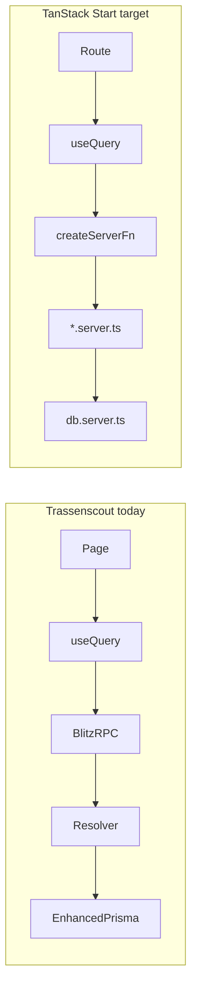

# Database & Prisma migration — Trassenscout → TanStack Start (TILDA-aligned)

Analysis date: 2026-06-04  
Reference: [`tilda-geo/app`](../../tilda-geo/app)  
Companion: [`tech-stack-migration.md`](./tech-stack-migration.md)

This document focuses on **Prisma, PostgreSQL, seeds, migrations, and the server-side DB layer** when Trassenscout moves from **Blitz/Next + Prisma 5** to **TanStack Start + Prisma 7**, aligning folder layout and conventions with TILDA as closely as the product allows.

---

## Executive summary

| Area                           | Trassenscout today                                        | Target (TILDA pattern)                                      |
| ------------------------------ | --------------------------------------------------------- | ----------------------------------------------------------- |
| ORM                            | Prisma **5.22** (`prisma-client-js`)                      | Prisma **7.8** (`prisma-client`, ESM, Bun runtime)          |
| Schema location                | `db/schema.prisma`                                        | `prisma/schema.prisma`                                      |
| Migrations                     | `db/migrations/`                                          | `prisma/migrations/`                                        |
| Client import                  | `@/db` → `enhancePrisma(PrismaClient)`                    | `@/server/db.server` → `@prisma/adapter-pg`                 |
| DB access from app             | Blitz RPC resolvers call `db` directly                    | Plain async functions; `createServerFn` in `*.functions.ts` |
| Auth tables                    | Blitz `User`/`Session`/`Token` (Int PK, `hashedPassword`) | better-auth + `Account`/`Verification` (String PK, OAuth)   |
| Postgres schema                | Default **`public`**                                      | Dedicated **`prisma`** schema (`@@schema("prisma")`)        |
| Env vars                       | Single `DATABASE_URL`                                     | Split `DATABASE_HOST/USER/PASSWORD/NAME`                    |
| Remote sync                    | `db/remote/`                                              | `scripts/db-pull/`                                          |
| Package manager for DB scripts | npm + some Bun                                            | Bun throughout                                              |

Trassenscout stays a **single-repo app** (not `tilda-geo/app/` nested under a monorepo root). Internal paths mirror TILDA; only the outer repo layout differs.

---

## Version inspection

### Prisma & PostgreSQL

| Package / tool              | Trassenscout                                                  | TILDA                                               | Migration note                                                                 |
| --------------------------- | ------------------------------------------------------------- | --------------------------------------------------- | ------------------------------------------------------------------------------ |
| `prisma` / `@prisma/client` | **5.22.0**                                                    | **7.8.0**                                           | Major upgrade; new config file required                                        |
| Client generator            | `prisma-client-js` → `node_modules/.prisma/client`            | `prisma-client` → `src/prisma/generated`            | Change all imports                                                             |
| Postgres driver             | implicit (Prisma built-in)                                    | `@prisma/adapter-pg` **7.8.0** + `pg` **8.20.0**    | Required for Prisma 7                                                          |
| Local Docker DB             | `postgres:16-alpine` (`ts-db`, port **6001**)                 | `ghcr.io/baosystems/postgis:17-3.5` (port **5432**) | Consider PostGIS 17 for parity; TS domain data is mostly non-spatial in Prisma |
| Migrations location         | `db/migrations/`                                              | `prisma/migrations/`                                | Move folder; history unchanged                                                 |
| CLI config                  | `package.json` → `"prisma": { "schema": "db/schema.prisma" }` | `prisma.config.ts` + same key in `package.json`     | Add `prisma.config.ts`                                                         |
| DB script runtime           | npm + Bun (mixed)                                             | Bun                                                 | Align migrate/seed/studio/db-pull scripts on Bun                               |

### Auth (DB-related)

|                   | Trassenscout                        | TILDA                             |
| ----------------- | ----------------------------------- | --------------------------------- |
| Library           | `@blitzjs/auth` + `secure-password` | `better-auth` + `prismaAdapter`   |
| User PK           | `Int` autoincrement                 | `String` `@default(cuid())`       |
| Password          | `User.hashedPassword`               | Removed; OAuth via `Account`      |
| Session           | Blitz session + `Session` model     | better-auth `Session` (String id) |
| Extra auth models | —                                   | `Account`, `Verification`         |

Trassenscout will likely **keep email/password invites** (product-specific). That implies a **hybrid auth migration**: adopt better-auth schema, but plan a data migration from Blitz password hashes and Int user IDs—not a copy of TILDA’s OSM-only OAuth model.

---

## Target folder structure (TanStack Start + TILDA-aligned)

```
trassenscout/
├── prisma.config.ts                 # NEW — Prisma CLI (migrate, studio, generate)
├── prisma/
│   ├── schema.prisma                # MOVE from db/schema.prisma
│   ├── migrations/                  # MOVE from db/migrations/
│   ├── seed.ts                      # MOVE from db/seeds.ts (entry)
│   └── seeds/                       # MOVE from db/seeds/
├── scripts/
│   ├── db-pull/                     # MOVE from db/remote/ (TS logic; TILDA folder name)
│   │   ├── get-dump.ts              # was db/remote/get-dump.ts
│   │   ├── restore-local.ts
│   │   ├── restore-staging.ts       # TS-specific; keep
│   │   ├── db-helpers.ts
│   │   ├── sql/                     # pre-restore.sql, post-restore.sql
│   │   └── data/                    # dump files (gitignored)
│   ├── predev/
│   │   └── checkMigration.ts        # NEW — block dev if migrations pending
│   └── prisma-generate-placeholder/ # NEW — postinstall without real DB
├── src/
│   ├── prisma/
│   │   └── generated/               # NEW — Prisma 7 client output (gitignored)
│   ├── server/
│   │   ├── db.server.ts             # REPLACE db/index.ts
│   │   ├── database-url.server.ts   # NEW — split DATABASE_* env
│   │   ├── auth/
│   │   │   ├── auth.server.ts       # better-auth config
│   │   │   ├── session.server.ts
│   │   │   └── auth.functions.ts
│   │   ├── projects/
│   │   │   ├── schema.ts
│   │   │   ├── projects.functions.ts
│   │   │   ├── queries/getProject.server.ts
│   │   │   └── mutations/createProject.server.ts
│   │   └── …                        # one folder per domain (see mapping below)
│   └── routes/
│       ├── api/                     # HTTP routes (exports, webhooks, auth catch-all)
│       └── …                        # file-based TanStack Router routes
├── docker-compose.yml               # UPDATE env: DATABASE_* instead of only DATABASE_URL
└── _migration/                      # planning docs (this file)
```

**Layout difference vs TILDA:** TILDA lives in `tilda-geo/app/` with env in `tilda-geo/.env`. Trassenscout keeps `.env` at repo root; script invocations use `bun --env-file=.env` instead of `../.env`.

---

## TILDA files — what they do

### Prisma & CLI

| TILDA path                             | Purpose                                                                                                  |
| -------------------------------------- | -------------------------------------------------------------------------------------------------------- |
| `prisma/schema.prisma`                 | Single source of truth for app models; all models in PostgreSQL schema `prisma` via `@@schema("prisma")` |
| `prisma/migrations/`                   | Timestamped SQL migrations; applied by `bun run migrate`                                                 |
| `prisma/seed.ts`                       | Orchestrates `prisma/seeds/*.ts` after `migrate reset`                                                   |
| `prisma.config.ts`                     | Wires schema path, migrations path, seed command, and CLI datasource URL (`?schema=prisma`)              |
| `scripts/prisma-generate-placeholder/` | Runs `prisma generate` on `postinstall` with dummy `DATABASE_*` so CI/Docker builds need no live DB      |
| `scripts/predev/checkMigration.ts`     | Fails or prompts on pending migrations before `dev` starts                                               |

### Runtime DB access

| TILDA path                           | Purpose                                                                                                                        |
| ------------------------------------ | ------------------------------------------------------------------------------------------------------------------------------ |
| `src/server/database-url.server.ts`  | Builds URLs from `DATABASE_HOST`, `DATABASE_USER`, `DATABASE_PASSWORD`, `DATABASE_NAME`; CLI URL adds `?schema=prisma`         |
| `src/server/db.server.ts`            | Singleton `PrismaClient` with `@prisma/adapter-pg`; dev HMR reuse via `globalThis.__prisma`                                    |
| `src/server/prisma-client.server.ts` | **Second** client for geo/OSM `data` schema raw SQL (Martin tiles, processing)—not needed for Trassenscout Prisma models today |
| `src/prisma/generated/`              | Generated ESM client; import as `@/prisma/generated/client`                                                                    |

### Server domain pattern

Each domain under `src/server/<domain>/` typically has:

| File pattern            | Responsibility                                                                                                     |
| ----------------------- | ------------------------------------------------------------------------------------------------------------------ |
| `schema.ts`             | Zod input/output schemas (shared client + server)                                                                  |
| `queries/*.server.ts`   | Read-only DB functions; import `db` from `@/server/db.server`; may throw `notFound()` from TanStack Router         |
| `mutations/*.server.ts` | Writes; call `requireAdmin` / auth helpers; return `{ success, message, errors }` for forms                        |
| `<domain>.functions.ts` | **`createServerFn`** wrappers: validate input, pass `getRequestHeaders()` to mutations, expose typed RPC to client |
| `*QueryOptions.ts`      | TanStack Query `queryOptions()` factories (optional, used heavily in TILDA)                                        |

**Authorization shift:** Blitz `resolver.authorize()` and `authorizeProjectMember()` move into explicit helpers (e.g. `requireAdmin(headers)`, `checkProjectAuthorization(session, projectSlug)`) called from `.server.ts` files or `createServerFn` handlers.

### Auth (DB touchpoints)

| TILDA path                          | Purpose                                                                                  |
| ----------------------------------- | ---------------------------------------------------------------------------------------- |
| `src/server/auth/auth.server.ts`    | `betterAuth()` + `prismaAdapter(db)` + OSM OAuth plugins                                 |
| `src/server/auth/session.server.ts` | `getAppSession`, `requireAdmin`, cookie/session helpers                                  |
| `src/routes/api/auth.$.ts`          | HTTP handler for better-auth (manual cookie forwarding—no `tanstackStartCookies` plugin) |

---

## Trassenscout today — DB-related files

| Current path                   | Purpose                                                                               |
| ------------------------------ | ------------------------------------------------------------------------------------- |
| `db/schema.prisma`             | 36 models, enums, relations; generator `prisma-client-js`; datasource `DATABASE_URL`  |
| `db/migrations/`               | Timestamped SQL migrations                                                            |
| `db/index.ts`                  | `enhancePrisma(PrismaClient)` — Blitz middleware/wrap                                 |
| `db/seeds.ts` + `db/seeds/`    | Seed orchestration (`SEED_ONLY_USERS` flag)                                           |
| `db/remote/`                   | Remote pull/restore tooling (see [Remote database tooling](#remote-database-tooling)) |
| `src/server/**/queries/*.ts`   | Blitz `resolver.pipe(resolver.zod(...), resolver.authorize(...))`                     |
| `src/server/**/mutations/*.ts` | Same resolver pattern for writes                                                      |
| `src/authorization/`           | `authorizeProjectMember`, role constants (stays; called from `.server.ts`)            |
| `.cursor/rules/base.mdc`       | “Use Blitz for migrations” — update after migration                                   |

**Client usage:** ~200+ files import `db from "@/db"` or types from `@prisma/client`.

---

## Move map: Trassenscout → target

### Prisma root

| From                             | To                       | Change                                                                                        |
| -------------------------------- | ------------------------ | --------------------------------------------------------------------------------------------- |
| `db/schema.prisma`               | `prisma/schema.prisma`   | Upgrade generator; optional `@@schema("prisma")`; auth model changes                          |
| `db/migrations/*`                | `prisma/migrations/*`    | Move as-is; update `migration_lock.toml` if provider string changes                           |
| `db/seeds.ts`                    | `prisma/seed.ts`         | Default export → TILDA-style top-level `seed()` + `process.exit` or keep export for Bun       |
| `db/seeds/*.ts`                  | `prisma/seeds/*.ts`      | Update imports: `@/db` → `@/server/db.server`, `@prisma/client` → `@/prisma/generated/client` |
| `db/index.ts`                    | **DELETE**               | Replaced by `src/server/db.server.ts`                                                         |
| `package.json` `"prisma.schema"` | `"prisma/schema.prisma"` | Plus add `prisma.config.ts`                                                                   |

### Remote database tooling

Trassenscout’s `db/remote/` tooling is the source of truth. TILDA only supplies the target folder name (`scripts/db-pull/`). Behavior, safety checks, and flows stay as implemented today.

| Current path                     | Purpose                                                                                              |
| -------------------------------- | ---------------------------------------------------------------------------------------------------- |
| `db/remote/get-dump.ts`          | Pull dump from production or staging via SSH tunnel (`DATABASE_URL` / `DATABASE_URL_STAGING`)        |
| `db/remote/restore-local.ts`     | Restore to local dev: verify `_Meta.ENV`, reset DB, restore, anonymize, `migrate deploy`, seed users |
| `db/remote/restore-staging.ts`   | Restore production dump to staging with anonymization (TS-specific; no TILDA equivalent)             |
| `db/remote/db-helpers.ts`        | Shared helpers: connection check, `_Meta` ENV guard, SSH tunnel hints, Bun SQL                       |
| `db/remote/sql/pre-restore.sql`  | Reset target database before restore                                                                 |
| `db/remote/sql/post-restore.sql` | Anonymize emails after restore                                                                       |
| `db/remote/data/`                | Generated dumps (gitignored)                                                                         |
| `db/remote/README.md`            | Usage docs for local + staging workflows                                                             |

**Move map** (location only):

| From                           | To                                   |
| ------------------------------ | ------------------------------------ |
| `db/remote/get-dump.ts`        | `scripts/db-pull/get-dump.ts`        |
| `db/remote/restore-local.ts`   | `scripts/db-pull/restore-local.ts`   |
| `db/remote/restore-staging.ts` | `scripts/db-pull/restore-staging.ts` |
| `db/remote/db-helpers.ts`      | `scripts/db-pull/db-helpers.ts`      |
| `db/remote/sql/`               | `scripts/db-pull/sql/`               |
| `db/remote/data/`              | `scripts/db-pull/data/`              |
| `db/remote/README.md`          | `scripts/db-pull/README.md`          |

Update script invocations only where needed (e.g. `blitz prisma migrate deploy` → `bun prisma migrate deploy`, env vars when adopting `DATABASE_*`). Do not replace TS flows with TILDA’s schema-scoped pull model.

### Other tooling scripts

| From | To                                     | Change                                                   |
| ---- | -------------------------------------- | -------------------------------------------------------- |
| —    | `scripts/predev/checkMigration.ts`     | Port from TILDA — block dev if migrations pending        |
| —    | `scripts/prisma-generate-placeholder/` | Port from TILDA — `postinstall` generate without live DB |

### Server layer (per domain)

| From                                       | To                                                | Responsibility change                                         |
| ------------------------------------------ | ------------------------------------------------- | ------------------------------------------------------------- |
| `src/server/<domain>/queries/getX.ts`      | `src/server/<domain>/queries/getX.server.ts`      | Remove `resolver.*`; export plain `async function getX()`     |
| `src/server/<domain>/mutations/createX.ts` | `src/server/<domain>/mutations/createX.server.ts` | Remove Blitz authorize pipe; call auth helpers with `Headers` |
| —                                          | `src/server/<domain>/<domain>.functions.ts`       | **NEW** — `createServerFn` for each former RPC default export |
| `src/server/<domain>/schema.ts`            | same path                                         | Zod 4 migration; enums from `@/prisma/generated/client`       |

### npm scripts (DB)

| Trassenscout                                   | Target                                                                          |
| ---------------------------------------------- | ------------------------------------------------------------------------------- |
| `npm run migrate` → `blitz prisma migrate dev` | `bun run migrate` → `bun prisma migrate dev`                                    |
| `npm run migrate:create`                       | `bun run migrate-create` (write + format + open)                                |
| `npm run migrate:check`                        | `bun run migrate-check`                                                         |
| `npm run studio` → `blitz prisma studio`       | `bun run studio`                                                                |
| `npm run seed` → `blitz db seed`               | `bun run seed` → `prisma migrate reset` + `prisma db seed`                      |
| `npm run db:getDump` / `db:restore:local`      | `bun run db-pull:get-dump` / `db-pull:restore-local` (names TBD; same TS flows) |

---

## Domain mapping: `src/server/` folders

Trassenscout domains map 1:1 to TILDA-style folders. Each gets `*.functions.ts` when exposed to the client.

| Trassenscout domain                            | TILDA analogue           | Notes                                                          |
| ---------------------------------------------- | ------------------------ | -------------------------------------------------------------- |
| `projects`                                     | `regions`                | Same “tenant” concept (Project vs Region); slug-based routing  |
| `memberships`                                  | `memberships`            | TS: `projectId`; TILDA: `regionId`                             |
| `users`                                        | `users`                  | Major schema/auth differences                                  |
| `auth`                                         | `auth`                   | Replace Blitz with better-auth                                 |
| `invites`                                      | —                        | TS-specific; keep                                              |
| `uploads`                                      | `uploads`                | Align presign flow with TILDA `uploads.functions.ts` over time |
| `subsections`, `subsubsections`, …             | —                        | TS-specific planning models                                    |
| `projectRecords`, `project-record-comments`, … | —                        | TS-specific                                                    |
| `surveys`, `survey-responses`, …               | —                        | TS-specific participation                                      |
| `acquisitionAreas`, `parcels`, `alkis`         | —                        | TS land-acquisition                                            |
| `contacts`, `operators`, `qualityLevels`, …    | —                        | TS-specific lookup tables                                      |
| `logEntries`, `systemLogEntries`               | —                        | TS audit trail                                                 |
| `emailTemplates`, `supportDocuments`           | —                        | TS-specific                                                    |
| `luckycloud`                                   | —                        | TS integration; stays as server-only utils                     |
| `admin`                                        | `admin`                  | Admin server fns + routes                                      |
| `shared`, `relations`                          | `utils/validation`, etc. | Shared geometry/validation helpers                             |

TILDA-only domains (`qa-configs`, `notes`, `statistics`, `osm`, `static-dataset-categories`) have no Trassenscout counterpart.

---

## Prisma schema migration details

### 1. Generator & client output

**Today (`db/schema.prisma`):**

```prisma
generator client {
  provider = "prisma-client-js"
}
datasource db {
  provider = "postgresql"
  url      = env("DATABASE_URL")
}
```

**Target (TILDA-aligned):**

```prisma
generator client {
  provider            = "prisma-client"
  output              = "../src/prisma/generated"
  runtime             = "bun"
  moduleFormat        = "esm"
  importFileExtension = "ts"
}

datasource db {
  provider = "postgres"
  schemas  = ["prisma"]   // optional but recommended for FMC consistency
}
```

URL moves to `prisma.config.ts`:

```ts
import { defineConfig } from "prisma/config"
import { getPrismaCliDatabaseUrl } from "./src/server/database-url.server"

export default defineConfig({
  schema: "prisma/schema.prisma",
  migrations: { path: "prisma/migrations", seed: "bun prisma/seed.ts" },
  datasource: { url: getPrismaCliDatabaseUrl() },
})
```

### 2. PostgreSQL schema namespace

TILDA isolates app tables in schema **`prisma`** so PostGIS/OSM data can live in **`data`**.

Trassenscout today uses **`public`** only. Options:

| Option                         | Pros                              | Cons                                                                                                          |
| ------------------------------ | --------------------------------- | ------------------------------------------------------------------------------------------------------------- |
| **A. Stay on `public`**        | No table moves; simpler migration | Diverges from TILDA; harder if geo tables added later                                                         |
| **B. Move to `prisma` schema** | Matches TILDA; clean separation   | One-time migration: `CREATE SCHEMA prisma; ALTER TABLE … SET SCHEMA prisma;` + update all migrations baseline |

**Recommendation:** Option **B** if migrating auth/user IDs anyway; do schema + auth in one maintenance window.

### 3. Auth & user ID migration (high impact)

| Model                 | Trassenscout | Target                                                  |
| --------------------- | ------------ | ------------------------------------------------------- |
| `User.id`             | `Int`        | `String` (cuid) — **breaking FK on all relations**      |
| `User.hashedPassword` | Blitz/scrypt | better-auth compatible hash **or** force password reset |
| `Session`             | Blitz shape  | better-auth `Session`                                   |
| New                   | —            | `Account`, `Verification`                               |

Every model referencing `userId: Int` (~20+ relations) needs migration SQL and application updates. Plan:

1. Add better-auth tables alongside legacy (dual-write period), **or**
2. Big-bang migration script: map `old_user_id → new_cuid`, rewrite FKs, drop Int columns.

Invites/tokens tied to email can survive if `User.email` stays unique.

### 4. Enums & domain models

Trassenscout-specific enums (`SubsubsectionTypeEnum`, `ProjectRecordReviewStateEnum`, …) stay in schema; only generator/import paths change.

Optional: re-enable zod generation (TILDA does not use `zod-prisma`; TS has hand-written `schema.ts` per domain—**keep hand-written** for control).

### 5. Meta / environment safety

Both apps use a **`Meta`** table (`_Meta` in SQL) with `ENV` key for db-pull safety. Keep unchanged; update restore scripts to query the correct schema if moving to `prisma.Meta`.

---

## Responsibility changes (behavioral)

### Data access boundary



| Concern              | Blitz (today)                                      | TanStack Start (target)                                   |
| -------------------- | -------------------------------------------------- | --------------------------------------------------------- |
| Type-safe API        | RPC resolver exports                               | `createServerFn` + Zod in `.functions.ts`                 |
| Authorization        | `resolver.authorize()`, `authorizeProjectMember()` | Explicit calls in handler with `getRequestHeaders()`      |
| Session in mutations | `ctx.session`                                      | `getAppSession(headers)`                                  |
| Not found            | `NotFoundError` from Blitz                         | `notFound()` from `@tanstack/react-router`                |
| Prisma client        | Blitz-enhanced (logging/middleware)                | Plain client; instrumentation via Nitro plugins if needed |
| Client import path   | `@/db`, `@prisma/client`                           | `@/server/db.server`, `@/prisma/generated/client`         |

### Example: memberships

**Today:** `src/server/memberships/mutations/createMembership.ts` — default export resolver, `resolver.authorize("ADMIN")`, returns created row.

**Target:**

- `mutations/createMembership.server.ts` — `requireAdmin(headers)`, form-style `{ success, message, errors }`, Prisma error mapping (see TILDA).
- `memberships.functions.ts` — `createMembershipFn = createServerFn({ method: 'POST' }).inputValidator(...).handler(...)`.
- React — `useMutation({ mutationFn: (d) => createMembershipFn({ data: d }) })` instead of `useMutation(createMembership)`.

---

## Seeds

|            | Trassenscout                                          | TILDA                                           |
| ---------- | ----------------------------------------------------- | ----------------------------------------------- |
| Entry      | `db/seeds.ts` (Blitz default export)                  | `prisma/seed.ts` (inline async IIFE)            |
| Scope flag | `SEED_ONLY_USERS=1`                                   | none (full seed always)                         |
| Domains    | projects, users, memberships, subsections, surveys, … | regions, users, memberships, uploads, notes, qa |

**Move:** all `db/seeds/*.ts` → `prisma/seeds/*.ts`; switch to `import db from '@/server/db.server'`.

**Keep:** `SEED_ONLY_USERS` for faster local onboarding.

---

## Environment variables

| Trassenscout           | TILDA                     | Notes                                          |
| ---------------------- | ------------------------- | ---------------------------------------------- |
| `DATABASE_URL`         | —                         | Replace with split vars for app + CLI          |
| —                      | `DATABASE_HOST`           | e.g. `127.0.0.1` / docker service name         |
| —                      | `DATABASE_USER`           |                                                |
| —                      | `DATABASE_PASSWORD`       |                                                |
| —                      | `DATABASE_NAME`           |                                                |
| `DATABASE_URL_STAGING` | `DATABASE_URL_STAGING`    | Remote pull (local `.env` only)                |
| —                      | `DATABASE_URL_PRODUCTION` | TILDA naming; TS may keep staging-specific key |
| —                      | `ENVIRONMENT`             | `development` required for local restore       |

**Docker Compose:** extend `ts-db` service or document `DATABASE_*` pointing at port 6001.

---

## Migration phases (DB-specific)

1. **Add Prisma 7 alongside 5** (branch) — `prisma.config.ts`, new generator output path, fix imports in a spike.
2. **Relocate** `db/` → `prisma/` without schema changes; verify `migrate status`.
3. **Introduce** `database-url.server.ts` + `db.server.ts`; replace `@/db` imports (codemod).
4. **Auth schema** — better-auth models; user ID migration plan + script.
5. **Optional** — move tables to `prisma` PostgreSQL schema.
6. **Relocate** `db/remote/` → `scripts/db-pull/` (TS tooling unchanged).
7. **Add** `checkMigration` to `predev`; `prisma-generate-placeholder` to `postinstall`.
8. **Convert** server modules domain-by-domain: `.server.ts` + `.functions.ts`; drop resolver exports.
9. **Remove** Blitz prisma wrapper, `enhancePrisma`, `@blitzjs/rpc` DB call sites.
10. **Verify** seeds, restore flow, staging anonymization, CI migrate deploy.

---

## What not to copy from TILDA

| TILDA artifact                                    | Reason                                            |
| ------------------------------------------------- | ------------------------------------------------- |
| `src/server/prisma-client.server.ts` (geo client) | No OSM `data` schema in Trassenscout Prisma layer |
| OSM OAuth-only auth                               | Trassenscout needs email/password + invites       |
| `schemas: ["prisma", "data"]` in datasource       | Only if TS adds processing/geo tables later       |
| Monorepo `app/` + root `.env`                     | Trassenscout single-repo layout                   |

---

## Checklist before cutover

- [ ] `bun prisma migrate status` clean on fresh clone
- [ ] `bun run seed` populates dev DB
- [ ] `bun run db-pull:restore-local` works with SSH tunnel + `_Meta` guard
- [ ] No imports from `@/db` or `@prisma/client` (only generated client)
- [ ] Auth: login, invite, password reset against new schema
- [ ] All former RPC endpoints have `.functions.ts` equivalent
- [ ] Docker/CI: `postinstall` generate, `migrate deploy` on deploy

---

_Generated from inspection of Trassenscout `db/`, `src/server/`, and `tilda-geo/app` Prisma/server/scripts layout (2026-06-04)._
