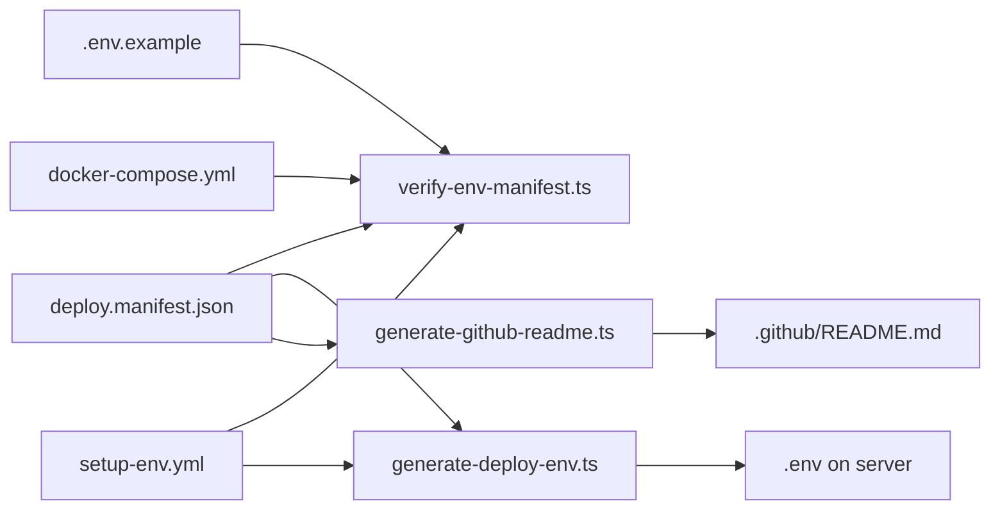

# Environment registry & startup validation — Trassenscout → TILDA-aligned

Analysis date: 2026-06-05  
Reference: [`tilda-geo/app`](../../tilda-geo/app), [`tilda-geo/.github`](../../tilda-geo/.github)  
Companion: [`docker.md`](./docker.md), [`db-migration.md`](./db-migration.md), [`tooling.md`](./tooling.md)

This document covers two related concerns TILDA handles well and Trassenscout (TS) handles only partially today:

1. **Deploy env registry** — a single manifest enforced across `.env.example`, Docker compose, and GitHub deploy workflows (TS has a hand-maintained markdown table).
2. **Runtime env validation** — Zod schema validated once at server startup, with TypeScript types derived from the same source (TS has hand-written `env.d.ts` and ad-hoc Zod in one mail helper).

---

## Executive summary

| Area                     | Trassenscout today                                                      | TILDA (`tilda-geo`)                                                                                                                          | Target for TS                               |
| ------------------------ | ----------------------------------------------------------------------- | -------------------------------------------------------------------------------------------------------------------------------------------- | ------------------------------------------- |
| Canonical deploy list    | Manual table in [`.github/README.md`](../.github/README.md)             | [`.github/env/deploy.manifest.json`](../../tilda-geo/.github/env/deploy.manifest.json)                                                       | JSON manifest + generated README table      |
| Deploy `.env` generation | Inline heredoc in [`setup-env.yml`](../.github/workflows/setup-env.yml) | [`generate-deploy-env.ts`](../../tilda-geo/.github/scripts/generate-deploy-env.ts) from manifest                                             | Manifest-driven generator                   |
| Drift detection          | None in CI                                                              | [`verify-env-manifest.ts`](../../tilda-geo/.github/scripts/verify-env-manifest.ts) in CI + deploy                                            | Same script (TS-adapted paths)              |
| Local dev example        | [`.env.local.example`](../.env.local.example)                           | [`.env.example`](../../tilda-geo/.env.example) at repo root                                                                                  | Rename → `.env.example`; sync with manifest |
| Runtime types            | Hand-written [`src/env.d.ts`](../src/env.d.ts)                          | [`src/env.d.ts`](../../tilda-geo/app/src/env.d.ts) extends Zod-inferred types                                                                | Zod schema → `env.d.ts` augmentation        |
| Startup validation       | None (fail at first use)                                                | Nitro plugin [`nitro-env-validation.plugin.server.ts`](../../tilda-geo/app/src/server/instrumentation/nitro-env-validation.plugin.server.ts) | Same pattern after TanStack Start           |
| Script-only env          | Documented only in `.env.local.example`                                 | `envFullSchema` + `scripts/shared/env.ts` `getValidatedEnv()`                                                                                | Pick from full schema per script            |
| Client env prefix        | `NEXT_PUBLIC_*`                                                         | `VITE_*`                                                                                                                                     | `VITE_*` ([`docker.md`](./docker.md))       |

---

## Part 1 — Deploy env registry (manifest)

### How TILDA does it



**Manifest entry shape** (each deploy variable):

| Field                       | Purpose                                                                                          |
| --------------------------- | ------------------------------------------------------------------------------------------------ |
| `name`                      | Key written to server `.env` and passed to containers                                            |
| `sourceEnv`                 | GitHub Actions step `env:` key (e.g. `SECRET_SESSION_SECRET_KEY` → `secrets.SESSION_SECRET_KEY`) |
| `githubSource`              | Human/docs reference (`vars.FOO`, `secrets.BAR`, `inputs.ENVIRONMENT`)                           |
| `required` / `defaultValue` | Used by `generate-deploy-env.ts`                                                                 |
| `description`               | README table + review context                                                                    |
| `sensitive`                 | Docs only (marks secrets in generated table)                                                     |

**Enforcement** (`verify-env-manifest.ts`):

- Every manifest `name` must appear in `.env.example` and `docker-compose.yml` (as `${VAR}` interpolation or pass-through `VAR:` line).
- Every manifest `sourceEnv` must appear in the `setup-env.yml` `env:` block before `generate-deploy-env`.
- Compose and workflow must not reference deploy vars outside the manifest (except an explicit allowlist for infra aliases like `PGHOST`, `FORCE_COLOR`).

**When it runs:**

- Every PR — [TILDA `ci.yml`](../../tilda-geo/.github/workflows/ci.yml).
- Every deploy — [`setup-env.yml`](../../tilda-geo/.github/workflows/setup-env.yml) before SCP.
- Locally — `bun run env-check` in `app/package.json`.

### How Trassenscout does it today

| Artifact                                                    | State                                                                                                                                    |
| ----------------------------------------------------------- | ---------------------------------------------------------------------------------------------------------------------------------------- |
| [`.github/README.md`](../.github/README.md)                 | Static markdown table; easy to drift from reality                                                                                        |
| [`setup-env.yml`](../.github/workflows/setup-env.yml)       | 50-line SSH heredoc; duplicates README; no validation                                                                                    |
| [`docker-compose.server.yml`](../docker-compose.server.yml) | `${ECR_REGISTRY}`, `${NEXT_PUBLIC_APP_ENV}`, `${APP_DOMAIN}`, `${POSTGRES_*}` interpolated; app/imap use `env_file: ".env"` pass-through |
| [`.env.local.example`](../.env.local.example)               | Local-only; reminder to update `env.d.ts` manually                                                                                       |
| CI                                                          | **No** env manifest check ([`tooling.md`](./tooling.md) — no PR CI yet)                                                                  |

**Known drift today:**

- IMAP listener vars (`IMAP_*`, `TS_API_WEBHOOK_URL`, `MAIL_PROCESSING_DELAY`, …) are in `setup-env.yml` but **not** in `.github/README.md`.
- `MAILJET_*` in `.env.local.example` — **unused** in code (legacy; remove on cleanup).
- `OPENAI_API_KEY`, `LANGFUSE_*` in deploy `.env` and `env.d.ts` but absent from README table (SDK reads them implicitly via `@ai-sdk/openai` / `langfuse`).

### Target layout for TS

```
.github/
├── env/
│   └── deploy.manifest.json      # NEW — canonical deploy variables
├── scripts/
│   ├── verify-env-manifest.ts    # PORT from TILDA (path tweaks)
│   ├── generate-deploy-env.ts    # PORT from TILDA
│   └── generate-github-readme.ts # PORT from TILDA
├── README.md                     # GENERATED table block (like TILDA)
└── workflows/
    └── setup-env.yml             # verify + generate-deploy-env + SCP .env.deploy.generated
.env.example                      # RENAME from .env.local.example; manifest-synced keys
docker-compose.server.yml         # explicit pass-through env: lines for manifest keys
```

### TS manifest — proposed variables

Deploy manifest should list **server `.env` keys** consumed by `app` and/or `imap-listener` in production. Align naming with [`db-migration.md`](./db-migration.md) and [`docker.md`](./docker.md).

| Name                    | GitHub source (today)             | Notes                                                                                       |
| ----------------------- | --------------------------------- | ------------------------------------------------------------------------------------------- |
| `ENVIRONMENT`           | `inputs.ENVIRONMENT`              | Deployment target; image tags                                                               |
| `VITE_APP_ENV`          | derived from `inputs.ENVIRONMENT` | Replaces `NEXT_PUBLIC_APP_ENV`                                                              |
| `VITE_APP_ORIGIN`       | `vars.APP_ORIGIN`                 | Replaces `NEXT_PUBLIC_APP_ORIGIN`                                                           |
| `APP_DOMAIN`            | `vars.APP_DOMAIN`                 | Traefik labels in compose                                                                   |
| `DATABASE_HOST`         | `vars.POSTGRES_HOST`              | Split DB ([`db-migration.md`](./db-migration.md)); or keep `POSTGRES_HOST` name in manifest |
| `DATABASE_USER`         | `secrets.POSTGRES_USER`           |                                                                                             |
| `DATABASE_PASSWORD`     | `secrets.POSTGRES_PASSWORD`       |                                                                                             |
| `DATABASE_NAME`         | `vars.POSTGRES_DB`                |                                                                                             |
| `SESSION_SECRET_KEY`    | `secrets.SESSION_SECRET_KEY`      |                                                                                             |
| `BREVO_API_KEY`         | `secrets.BREVO_API_KEY`           |                                                                                             |
| `ADMIN_EMAIL`           | `vars.ADMIN_EMAIL`                |                                                                                             |
| `S3_UPLOAD_KEY`         | `secrets.S3_UPLOAD_KEY`           | Keep TS names (TILDA uses `S3_KEY` — no need to rename)                                     |
| `S3_UPLOAD_SECRET`      | `secrets.S3_UPLOAD_SECRET`        |                                                                                             |
| `S3_UPLOAD_ROOTFOLDER`  | derived `upload-${ENVIRONMENT}`   | Today composed in heredoc                                                                   |
| `TS_API_KEY`            | `secrets.TS_API_KEY`              | Shared by app + imap-listener                                                               |
| `OPENAI_API_KEY`        | `secrets.OPENAI_API_KEY`          |                                                                                             |
| `LANGFUSE_SECRET_KEY`   | `secrets.LANGFUSE_SECRET_KEY`     |                                                                                             |
| `LANGFUSE_PUBLIC_KEY`   | `secrets.LANGFUSE_PUBLIC_KEY`     |                                                                                             |
| `LANGFUSE_BASEURL`      | `vars.LANGFUSE_BASEURL`           |                                                                                             |
| `LUCKY_CLOUD_TOKEN`     | `secrets.LUCKY_CLOUD_TOKEN`       |                                                                                             |
| `ECR_REGISTRY`          | `vars.ECR_REGISTRY`               |                                                                                             |
| `IMAP_HOST`             | `vars.IMAP_HOST`                  | imap-listener                                                                               |
| `IMAP_PORT`             | `vars.IMAP_PORT`                  |                                                                                             |
| `IMAP_USER`             | `vars.IMAP_USER`                  |                                                                                             |
| `IMAP_PASSWORD`         | `secrets.IMAP_PASSWORD`           |                                                                                             |
| `IMAP_SECURE`           | default `true`                    |                                                                                             |
| `IMAP_INBOX_FOLDER`     | default `INBOX`                   |                                                                                             |
| `IMAP_DONE_FOLDER`      | default `INBOX/DONE`              |                                                                                             |
| `IMAP_ERROR_FOLDER`     | default `INBOX/ERROR`             |                                                                                             |
| `TS_API_WEBHOOK_URL`    | derived `http://app:4000/api/...` | Port from [`docker.md`](./docker.md)                                                        |
| `MAIL_PROCESSING_DELAY` | default `10000`                   |                                                                                             |
| `MAX_RETRIES`           | default `3`                       |                                                                                             |
| `HEALTH_PORT`           | default `3100`                    |                                                                                             |

**Out of manifest** (local / script-only — stay in `.env.example` comments only):

- `DATABASE_URL`, `DATABASE_URL_STAGING`, `DATABASE_URL_PRODUCTION` — local dev & `db/remote/*` until fully on `DATABASE_*`
- `TS_API_KEY_STAGING`, `TS_API_KEY_PRODUCTION` — `scripts/csv-import`
- `NEXT_PUBLIC_PUBLIC_SURVEY_START_STAGE` / future `VITE_PUBLIC_SURVEY_START_STAGE` — dev-only survey override
- `SEED_ONLY_USERS` — `db/seeds.ts`
- `MAILJET_*` — remove (dead)

### Adaptations when porting TILDA scripts

| TILDA assumption                                      | TS change                                                                                                                  |
| ----------------------------------------------------- | -------------------------------------------------------------------------------------------------------------------------- |
| `docker-compose.yml` at repo root                     | Point verifier at **`docker-compose.server.yml`** (production compose)                                                     |
| Monorepo `app/` subfolder                             | Scripts live at repo root; `generate-deploy-env` host validation schemas N/A unless TS adds `APP_URL`-style hosts          |
| `DATABASE_URL` in allowlist                           | Keep allowlist entry if local compose still uses composite URL                                                             |
| `verify-env-manifest` parses `setup-env` `env:` block | Replace heredoc step with `generate-deploy-env` + explicit `env:` mappings (copy TILDA pattern)                            |
| Image tag `${ENVIRONMENT}-latest`                     | TS today uses `${NEXT_PUBLIC_APP_ENV}-latest` → `${VITE_APP_ENV}-latest` or `${ENVIRONMENT}-latest` (pick one in manifest) |

### `docker-compose.server.yml` changes for manifest compliance

TILDA lists every app env explicitly under `environment:` (pass-through from `.env`). TS should do the same for **app** and **imap-listener** so `verify-env-manifest` can grep compose refs.

Example (app service, after TanStack migration):

```yaml
environment:
  DATABASE_HOST: ${DATABASE_HOST}
  DATABASE_USER: ${DATABASE_USER}
  DATABASE_PASSWORD: ${DATABASE_PASSWORD}
  DATABASE_NAME: ${DATABASE_NAME}
  VITE_APP_ENV:
  VITE_APP_ORIGIN:
  SESSION_SECRET_KEY:
  # … all manifest keys …
  FORCE_COLOR: 1
```

Today TS relies on `env_file: ".env"` alone — that works at runtime but **does not satisfy** TILDA-style manifest verification.

### Issues / risks for TS

| Issue                                                             | Severity | Mitigation                                                                                                                                                       |
| ----------------------------------------------------------------- | -------- | ---------------------------------------------------------------------------------------------------------------------------------------------------------------- |
| **Two services** (app + imap-listener) share one `.env`           | Low      | Single manifest; both services list keys they need in compose pass-through                                                                                       |
| **`DATABASE_URL` vs `DATABASE_*` split**                          | Medium   | Coordinate with [`db-migration.md`](./db-migration.md); manifest uses split vars; allow `DATABASE_URL` in verifier allowlist for local `docker-compose.yml` only |
| **Rename `NEXT_PUBLIC_*` → `VITE_*`**                             | Medium   | One migration PR: manifest, compose, Dockerfile build args, `envSchema`, code ([`docker.md`](./docker.md))                                                       |
| **S3 naming** (`S3_UPLOAD_*` vs TILDA `S3_*`)                     | Low      | Keep TS names in manifest — no benefit to renaming                                                                                                               |
| **Derived values** (`S3_UPLOAD_ROOTFOLDER`, `TS_API_WEBHOOK_URL`) | Low      | `defaultValue` + document derivation; or compute in `generate-deploy-env.ts`                                                                                     |
| **No PR CI yet**                                                  | High     | Add `verify-env-manifest` to new `ci.yml` ([`tooling.md`](./tooling.md))                                                                                         |
| **imap-listener separate image**                                  | Low      | Same `.env` on server; imap-listener Dockerfile does not need manifest keys at build time                                                                        |
| **GitHub secret naming**                                          | Low      | TS uses `POSTGRES_*` in GitHub; manifest `githubSource` documents actual paths; `sourceEnv` uses prefixed step vars                                              |

### Migration steps — registry

1. Add `.github/env/deploy.manifest.json` with table above (adjust after `DATABASE_*` decision).
2. Port `.github/scripts/{verify-env-manifest,generate-deploy-env,generate-github-readme}.ts` — update paths for `docker-compose.server.yml`.
3. Add generation markers to `.github/README.md`; run `generate-github-readme.ts`.
4. Rename `.env.local.example` → `.env.example`; align keys with manifest + script-only section.
5. Update `docker-compose.server.yml` with explicit pass-through `environment:` entries.
6. Rewrite `setup-env.yml`: verify manifest → `generate-deploy-env` → SCP `.env.deploy.generated` → rename on server (TILDA pattern).
7. Add `env-check:*` scripts to `package.json` and `verify-env-manifest` to PR CI.
8. Remove inline heredoc and hand-maintained README rows.
9. Delete dead `MAILJET_*` from example env.

---

## Part 2 — Runtime Zod validation at startup

### How TILDA does it

**Single schema file** — [`app/src/server/envSchema.ts`](../../tilda-geo/app/src/server/envSchema.ts):

| Export                          | Role                                                                                                       |
| ------------------------------- | ---------------------------------------------------------------------------------------------------------- |
| `envViteSchema`                 | Client + server public flags (`VITE_APP_ENV`, `VITE_APP_ORIGIN`, …)                                        |
| `envServerSchema`               | Server-only secrets and infra                                                                              |
| `envScriptOnlySchemaPart`       | Mapbox tokens, `API_ROOT_URL`, staging-only API keys — validated in scripts, not at app boot               |
| `envProcessingSchema`           | Processing container — documented in full schema, not boot-required                                        |
| `envAppStartupValidationSchema` | **Discriminated union** on `VITE_APP_ENV` (e.g. `BREVO_API_KEY` optional in dev, required in staging/prod) |
| `envFullSchema`                 | Union for types + script `pick()`                                                                          |

**Design rules** (from TILDA comments):

- No `z.coerce` — env vars are strings at runtime; types must match actual usage.
- No `.strict()` on full schema — scripts may have extra keys.
- Startup schema is a **subset** — processing/script keys are not required to boot the web app.

**Nitro plugin** — registered in [`vite.config.ts`](../../tilda-geo/app/vite.config.ts):

```ts
"src/server/instrumentation/nitro-env-validation.plugin.server.ts"
```

On boot: `envAppStartupValidationSchema.safeParse(process.env)` → log `z.prettifyError` and **throw** (server does not start).

**Types** — [`app/src/env.d.ts`](../../tilda-geo/app/src/env.d.ts):

```ts
interface ImportMetaEnv extends EnvVite {}
namespace NodeJS {
  interface ProcessEnv extends EnvFullSchema {}
}
```

**Scripts** — [`app/scripts/shared/env.ts`](../../tilda-geo/app/scripts/shared/env.ts):

```ts
export function getValidatedEnv<T>(schema: z.ZodType<T>): T {
  return schema.parse(process.env) as T
}
```

Scripts import `envFullSchema.pick({ ... })` for their subset.

### How Trassenscout does it today

| Piece                             | State                                                                                                             |
| --------------------------------- | ----------------------------------------------------------------------------------------------------------------- |
| [`src/env.d.ts`](../src/env.d.ts) | Hand-maintained; comment in `.env.local.example` says “update whenever file changes”                              |
| Startup validation                | **None** — missing `SESSION_SECRET_KEY` fails deep inside Blitz auth                                              |
| Partial Zod                       | [`getBrevoApiKeyForSending.ts`](../emails/mailers/utils/getBrevoApiKeyForSending.ts) — local schema for mail only |
| `isEnv` helpers                   | [`src/core/utils/isEnv.ts`](../src/core/utils/isEnv.ts) reads `NEXT_PUBLIC_APP_ENV`                               |
| Instrumentation                   | [`src/instrumentation.ts`](../src/instrumentation.ts) — Langfuse OTEL only, no env check                          |

### Target for TS — `src/server/envSchema.ts`

Mirror TILDA structure with TS-specific keys:

```ts
// Sketch — implement after VITE rename and DATABASE_* split

const environmentValues = z.enum(["development", "staging", "production"])
const requiredString = z.string().min(1)

export const envViteSchema = z.object({
  VITE_APP_ENV: environmentValues,
  VITE_APP_ORIGIN: z.url().optional(), // required in staging/prod
  VITE_PUBLIC_SURVEY_START_STAGE: z.enum(["part1", "part2", "part3", "end"]).optional(),
})

const envServerSchema = z.object({
  SESSION_SECRET_KEY: requiredString,
  DATABASE_HOST: requiredString,
  DATABASE_USER: requiredString,
  DATABASE_PASSWORD: requiredString,
  DATABASE_NAME: requiredString,
  ADMIN_EMAIL: z.string().email(),
  S3_UPLOAD_KEY: requiredString,
  S3_UPLOAD_SECRET: requiredString,
  S3_UPLOAD_ROOTFOLDER: z.enum(["upload-production", "upload-staging", "upload-localdev"]),
  TS_API_KEY: requiredString,
  OPENAI_API_KEY: requiredString,
  LANGFUSE_SECRET_KEY: requiredString,
  LANGFUSE_PUBLIC_KEY: requiredString,
  LANGFUSE_BASEURL: z.url(),
  LUCKY_CLOUD_TOKEN: requiredString,
})

const envScriptOnlySchemaPart = z.object({
  DATABASE_URL: z.string().optional(),
  DATABASE_URL_STAGING: z.string().optional(),
  DATABASE_URL_PRODUCTION: z.string().optional(),
  TS_API_KEY_STAGING: z.string().optional(),
  TS_API_KEY_PRODUCTION: z.string().optional(),
  SEED_ONLY_USERS: z.string().optional(),
})

export const envAppStartupValidationSchema = z.discriminatedUnion("VITE_APP_ENV", [
  envViteSchema.extend(envServerSchema.shape).extend({
    VITE_APP_ENV: z.literal("development"),
    BREVO_API_KEY: z.string().optional(),
    OPENAI_API_KEY: z.string().optional(), // optional if AI features unused locally
  }),
  envViteSchema.extend(envServerSchema.shape).extend({
    VITE_APP_ENV: z.literal(["staging", "production"]),
    BREVO_API_KEY: requiredString,
    VITE_APP_ORIGIN: z.url(),
  }),
])

export const envFullSchema = envViteSchema
  .extend(envServerSchema.shape)
  .extend(envScriptOnlySchemaPart.shape)
```

**Refinements to decide during implementation:**

- Whether `OPENAI_API_KEY` is required in development (some devs may not run AI flows).
- Whether to keep composite `DATABASE_URL` in script schema until `db/remote/*` migrates to `DATABASE_*`.
- `z.url()` vs hostname-only for `LANGFUSE_BASEURL` (must match runtime strings).

### Nitro plugin for TS

Create `src/server/instrumentation/nitro-env-validation.plugin.server.ts` — copy TILDA plugin verbatim (paths/import aliases adjusted).

Register in TanStack Start / Vite config alongside other `nitro-*.plugin.server.ts` files (see TILDA [`vite.config.ts`](../../tilda-geo/app/vite.config.ts)).

**Behaviour:** fail fast on `bun run dev`, `bun run preview`, and production container start — same as TILDA.

### Update `src/env.d.ts`

Replace hand-written keys with schema inference:

```ts
import type { EnvFullSchema, EnvVite } from "./server/envSchema"

declare global {
  interface ImportMetaEnv extends EnvVite {}
  interface ImportMeta {
    readonly env: ImportMetaEnv
  }
  namespace NodeJS {
    interface ProcessEnv extends EnvFullSchema {}
  }
}
export {}
```

### Update call sites (incremental)

| Area                                   | Change                                                                                                    |
| -------------------------------------- | --------------------------------------------------------------------------------------------------------- |
| `src/core/utils/isEnv.ts`              | `import.meta.env.VITE_APP_ENV` (client); server helpers can use validated env or `process.env` after boot |
| `getBrevoApiKeyForSending.ts`          | Replace local schema with `envFullSchema.pick` or rely on startup validation                              |
| `db/remote/*.ts`                       | `getValidatedEnv` with script picks                                                                       |
| `scripts/csv-import/utils/env.ts`      | `getValidatedEnv`                                                                                         |
| Blitz-only `BLITZ_DEV_SERVER_ORIGIN`   | Remove after TanStack dev server                                                                          |
| Debug UI showing `NEXT_PUBLIC_APP_ENV` | Switch to `VITE_APP_ENV`                                                                                  |

### Issues / risks for TS

| Issue                                                                                    | Severity | Mitigation                                                                                                                           |
| ---------------------------------------------------------------------------------------- | -------- | ------------------------------------------------------------------------------------------------------------------------------------ |
| **Bun `process.env` typing** ([Bun #18594](https://github.com/oven-sh/bun/issues/18594)) | Low      | TILDA documents guard / `as string` after parse; startup plugin validates once                                                       |
| **Client vs server env**                                                                 | Medium   | `VITE_*` only in `envViteSchema`; never put secrets in Vite schema                                                                   |
| **Build-time vs runtime**                                                                | Medium   | Dockerfile `ARG VITE_APP_*` for client bundle; secrets **only** via runtime `.env` ([`docker.md`](./docker.md))                      |
| **Prisma generate placeholder**                                                          | Low      | Dummy `DATABASE_*` for build — already planned; must match schema shape                                                              |
| **Test env**                                                                             | Medium   | `.env.test` / Vitest: either load fixture env or use relaxed startup schema in `MODE=test`                                           |
| **imap-listener**                                                                        | Medium   | Separate Node process — **no Nitro plugin**; add small `config.ts` Zod parse (already partial manual checks) or share schema package |
| **Partial validation today**                                                             | Low      | Startup validation is strictly better than ad-hoc; keep `getValidatedEnv` for scripts with extra requirements                        |

### Migration steps — runtime validation

1. Land `src/server/envSchema.ts` with current `NEXT_PUBLIC_*` names first **or** combine with VITE rename (prefer single PR with rename).
2. Add Nitro env validation plugin; register in Vite config.
3. Rewrite `src/env.d.ts` from schema types.
4. Add `scripts/shared/env.ts` with `getValidatedEnv`.
5. Migrate `getBrevoApiKeyForSending` and `db/remote/*` to shared schema picks.
6. Update `isEnv.ts` to Vite `import.meta.env` pattern.
7. Add imap-listener `z.object({ ... }).parse(process.env)` at startup in `imap-listener/src/index.ts`.
8. Document in `.env.example` that `env-check` + dev start validate config.

---

## `package.json` scripts (target)

```json
{
  "env-check:verify-manifest": "bun .github/scripts/verify-env-manifest.ts",
  "env-check:docs:1sync": "bun .github/scripts/generate-github-readme.ts",
  "env-check:docs:2format": "bun run format",
  "env-check:docs": "bun run --sequential env-check:docs:*",
  "env-check": "bun run --parallel env-check:*"
}
```

Run `bun run env-check` after changing manifest, `.env.example`, compose, or `setup-env.yml`.

---

## Suggested migration order (env overall)

Coordinate with [`docker.md`](./docker.md) and [`db-migration.md`](./db-migration.md).

1. **Registry foundation** — manifest + port scripts + `.env.example` rename (can land before TanStack).
2. **CI** — `verify-env-manifest` on every PR ([`tooling.md`](./tooling.md)).
3. **Deploy workflow** — replace heredoc with `generate-deploy-env` (staging first).
4. **Compose** — explicit env pass-through in `docker-compose.server.yml`.
5. **VITE rename** — with TanStack scaffold (`NEXT_PUBLIC_*` → `VITE_*`).
6. **`DATABASE_*` split** — update manifest + `envSchema` together.
7. **Runtime validation** — `envSchema.ts` + Nitro plugin before first staging deploy on Nitro.
8. **Scripts + imap-listener** — `getValidatedEnv` picks; imap Zod boot check.
9. **Cleanup** — remove `MAILJET_*`, manual README rows, duplicate heredoc, old `NEXT_PUBLIC` references.

Steps 1–4 improve deploy safety **before** the framework migration. Steps 5–8 belong in the TanStack migration track.

---

## Quick reference

| Task                    | Trassenscout today           | Target (TILDA pattern)                         |
| ----------------------- | ---------------------------- | ---------------------------------------------- |
| Deploy variable list    | `.github/README.md` (manual) | `.github/env/deploy.manifest.json`             |
| Drift check             | none                         | `verify-env-manifest.ts` in CI + deploy        |
| Server `.env` on deploy | SSH heredoc                  | `generate-deploy-env.ts`                       |
| Local example           | `.env.local.example`         | `.env.example` (manifest-synced)               |
| TS types                | hand `env.d.ts`              | Zod-inferred `env.d.ts`                        |
| Boot validation         | none                         | Nitro plugin + `envAppStartupValidationSchema` |
| Script env              | ad-hoc / manual guards       | `getValidatedEnv(envFullSchema.pick(...))`     |
| Mail env guard          | local Zod in one file        | discriminated union in shared schema           |

---

_Generated from Trassenscout `.github/`, `src/env.d.ts`, `docker-compose.server.yml`, and TILDA `envSchema.ts`, `.github/env/deploy.manifest.json`, and env-check scripts._
