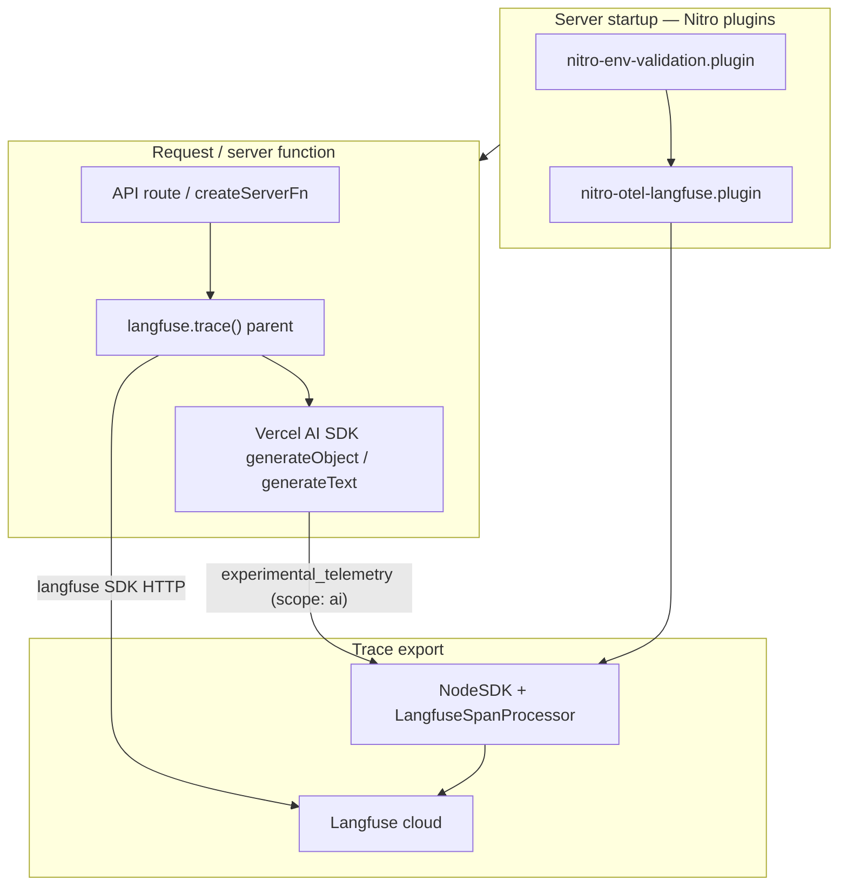

# Observability migration: Next.js instrumentation → TanStack Start

Analysis date: 2026-06-05  
Reference: [`tilda-geo/app`](../../tilda-geo/app) (TanStack Start + Nitro), Trassenscout today (Next.js + Blitz)  
Companion: [`env-check.md`](./env-check.md), [`docker.md`](./docker.md), [`tech-stack-migration.md`](./tech-stack-migration.md)

This document covers **OpenTelemetry bootstrap**, **Langfuse LLM tracing**, and **server startup hooks** when moving Trassenscout from Next.js `instrumentation.ts` + `@vercel/otel` to TanStack Start (Vite + Nitro, Bun preset).

---

## Executive summary

| Area | Trassenscout today | TILDA (`tilda-geo/app`) | Target for TS (TanStack Start) |
| --- | --- | --- | --- |
| Server bootstrap hook | Next [`instrumentation.ts`](../src/instrumentation.ts) (`register()` + `instrumentationHook`) | Nitro plugins under [`src/server/instrumentation/`](../../tilda-geo/app/src/server/instrumentation/) | Nitro plugin folder (TILDA pattern) |
| OTEL / traces | `@vercel/otel` + `langfuse-vercel` `LangfuseExporter` | **None** (no Langfuse, no OTEL) | `@opentelemetry/sdk-node` + `@langfuse/otel` `LangfuseSpanProcessor` |
| LLM tracing (app code) | `langfuse` SDK + Vercel AI SDK `experimental_telemetry` | N/A | **Keep pattern**; consolidate clients; env → `VITE_APP_ENV` |
| Service name | `"ts-ai-email-processor"` (stale copy-paste) | N/A | `"trassenscout"` |
| Env vars | `LANGFUSE_*`, `NEXT_PUBLIC_APP_ENV` on one client | N/A | `LANGFUSE_*` + `VITE_APP_ENV` ([`env-check.md`](./env-check.md)) |
| Deploy runtime | `pm2-runtime` + `next start` | `bun .output/server/index.mjs` | Same as TILDA ([`docker.md`](./docker.md)) |
| Request logging / APM | OTEL only (via Langfuse) | Console logging in places | Optional TanStack middleware later; Langfuse remains primary for AI |

**Recommendation:** Drop Vercel-specific packages. Bootstrap OTEL via a **Nitro plugin** registered in `vite.config.ts` (matches TILDA). Keep manual `langfuse.trace()` + `experimental_telemetry` in AI handlers until a later Langfuse SDK v4 migration.

---

## What Trassenscout has today

### Next.js instrumentation hook

```1:9:src/instrumentation.ts
import { registerOTel } from "@vercel/otel"
import { LangfuseExporter } from "langfuse-vercel"

export function register() {
  registerOTel({
    serviceName: "ts-ai-email-processor",
    traceExporter: new LangfuseExporter({ environment: process.env.NODE_ENV }),
  })
}
```

Enabled in [`next.config.js`](../next.config.js):

```39:43:next.config.js
  experimental: {
    // ...
    instrumentationHook: true,
  },
```

Next.js calls `register()` once when the Node server process starts, **before** handling requests. That initializes a global OpenTelemetry `TracerProvider` so the Vercel AI SDK can emit spans when `experimental_telemetry.isEnabled` is true.

### Application-level Langfuse usage

Two duplicate Langfuse clients with **different** environment sources:

| File | `environment` |
| --- | --- |
| [`langfuseClient.ts`](../src/app/api/(apiKey)/process-project-record-email/_utils/langfuseClient.ts) (email API) | `process.env.NEXT_PUBLIC_APP_ENV` |
| [`langfuseClient.ts`](../src/app/(loggedInProjects)/[projectSlug]/uploads/_actions/summarizeUpload/langfuseClient.ts) (uploads / reprocess) | `process.env.NODE_ENV` |

**Consumers** (all server-side):

| Module | Trace name | AI call | `flushAsync` |
| --- | --- | --- | --- |
| [`extractWithAI.ts`](../src/app/api/(apiKey)/process-project-record-email/_utils/extractWithAI.ts) | `process-email-to-project-record` | `generateObject` | via orchestrator |
| [`processProjectRecordEmailOrchestrator.ts`](../src/app/api/(apiKey)/process-project-record-email/_utils/processProjectRecordEmailOrchestrator.ts) | — | orchestrates | yes |
| [`generatePdfSummaryWithAI.ts`](../src/app/(loggedInProjects)/[projectSlug]/uploads/_actions/summarizeUpload/generatePdfSummaryWithAI.ts) | `summarize-upload` | `generateText` | yes |
| [`generateProjectRecordWithAI.ts`](../src/app/(loggedInProjects)/[projectSlug]/project-records/_actions/reprocessProjectRecord/generateProjectRecordWithAI.ts) | reprocess trace | `generateObject` | yes |
| [`processProjectRecordEmail.ts`](../src/app/(loggedInProjects)/[projectSlug]/project-records/_actions/processProjectRecordEmail.ts) | — | orchestrates | yes |

Shared telemetry pattern in AI calls:

```typescript
experimental_telemetry: {
  isEnabled: true,
  functionId: "...",
  metadata: { langfuseTraceId: trace.id },
}
```

Manual `langfuse.trace()` creates a parent trace; Vercel AI SDK OTEL spans (scope `ai`) nest under it when the global OTEL provider is registered — which is why `instrumentation.ts` matters.

### Packages (observability-related)

From [`package.json`](../package.json):

| Package | Role today |
| --- | --- |
| `@vercel/otel` | Next-specific OTEL registration |
| `langfuse-vercel` | `LangfuseExporter` for `@vercel/otel` (**deprecated**; Langfuse points to `@langfuse/otel`) |
| `langfuse` | Manual traces + flush |
| `@opentelemetry/api-logs`, `@opentelemetry/instrumentation`, `@opentelemetry/sdk-logs` | Transitive / partial OTEL stack |

Env: `LANGFUSE_SECRET_KEY`, `LANGFUSE_PUBLIC_KEY`, `LANGFUSE_BASEURL` ([`src/env.d.ts`](../src/env.d.ts), deploy workflows).

### What is **not** instrumented today

- HTTP request latency / error rates (no middleware tracing)
- Blitz RPC / server actions (except where AI runs)
- Database (Prisma)
- Client-side errors
- Structured production logging (console only in AI paths)

---

## TILDA reference (`tilda-geo/app`)

TILDA uses `src/server/instrumentation/` for **server startup side effects**, not observability:

| File | Purpose |
| --- | --- |
| [`nitro-env-validation.plugin.server.ts`](../../tilda-geo/app/src/server/instrumentation/nitro-env-validation.plugin.server.ts) | Zod validate `process.env` at startup |
| [`nitro-sql-registration.plugin.server.ts`](../../tilda-geo/app/src/server/instrumentation/nitro-sql-registration.plugin.server.ts) | Register PostGIS SQL functions before first request |
| [`nitro-legacy-cookie-sweep.plugin.server.ts`](../../tilda-geo/app/src/server/instrumentation/nitro-legacy-cookie-sweep.plugin.server.ts) | One-time cookie migration |
| [`registerSQLFunctions.server.ts`](../../tilda-geo/app/src/server/instrumentation/registerSQLFunctions.server.ts) | Shared registration logic |

Registered in [`vite.config.ts`](../../tilda-geo/app/vite.config.ts):

```typescript
nitro({
  preset: 'bun',
  plugins: [
    'src/server/instrumentation/nitro-env-validation.plugin.server.ts',
    'src/server/instrumentation/nitro-legacy-cookie-sweep.plugin.server.ts',
    'src/server/instrumentation/nitro-sql-registration.plugin.server.ts',
  ],
  // ...
})
```

**TILDA has no Langfuse, no `@vercel/otel`, no request tracing.** Trassenscout should adopt TILDA’s **folder and Nitro plugin wiring**, but add OTEL/Langfuse plugins TS-specific needs.

---

## TanStack Start docs (relevant features)

Sources:

- [TanStack Start — Observability](https://tanstack.com/start/latest/docs/framework/react/guide/observability)
- [Langfuse — Vercel AI SDK](https://langfuse.com/integrations/frameworks/vercel-ai-sdk)
- [Langfuse — OpenTelemetry](https://langfuse.com/integrations/native/opentelemetry)
- [Sentry — TanStack Start server instrumentation](https://docs.sentry.io/platforms/javascript/guides/tanstackstart-react/) (Nitro `--import` pattern)

### Built-in (no extra deps)

TanStack Start documents patterns we may add **later**, not required for Langfuse parity:

- Server function logging (`createServerFn` try/catch + timing)
- Request middleware (`createMiddleware().server`) for access logs
- Route loader timing
- Health `/health` and metrics routes
- Error boundaries

### OpenTelemetry (experimental, manual)

Official docs show:

1. **`NodeSDK.start()` before app code** — critical for AI SDK telemetry.
2. **Optional tracing middleware** via `createStart({ requestMiddleware: [...] })` for HTTP spans.
3. **Future:** first-class automatic instrumentation for server functions, middleware, loaders (not available yet).

Third-party options mentioned in the ecosystem (evaluate later, not Phase 1):

- [`autotel-tanstack`](https://www.npmjs.com/package/autotel-tanstack) — auto trace server functions
- [`nitro-opentelemetry`](https://www.npmjs.com/package/nitro-opentelemetry) — Nitro request/error spans

### Nitro + Bun deploy (TILDA)

Production CMD ([`app.Dockerfile`](../../tilda-geo/app.Dockerfile)):

```dockerfile
CMD ["/bin/sh", "-c", "bunx prisma migrate deploy && exec bun run .output/server/index.mjs"]
```

If OTEL must load **before** the server entry (Sentry/Langfuse edge cases), extend with Bun’s import hook:

```bash
bun --import ./instrument.server.mjs .output/server/index.mjs
```

Prefer Nitro plugin first; fall back to `--import` only if traces are incomplete in testing.

---

## Target architecture



### Design decisions

| Decision | Choice | Rationale |
| --- | --- | --- |
| Replace `@vercel/otel` | `@opentelemetry/sdk-node` + `@langfuse/otel` | Langfuse docs: `@vercel/otel` does not support OTEL JS SDK v2 used by current `@langfuse/otel`; `langfuse-vercel` is deprecated |
| Bootstrap location | Nitro plugin in `src/server/instrumentation/` | Matches TILDA; co-locate with env validation from [`env-check.md`](./env-check.md) |
| Keep `langfuse` v3 client short-term | Yes | Minimal AI code churn; link traces via `langfuseTraceId` metadata |
| Consolidate Langfuse clients | Single `src/server/observability/langfuseClient.server.ts` | Fix env inconsistency (`VITE_APP_ENV`) |
| HTTP/request APM | Defer | Langfuse is the product requirement; TanStack middleware optional Phase 2 |
| Service name | `trassenscout` | Replace stale `ts-ai-email-processor` |

---

## Migration plan

### Phase 0 — Prerequisites

- [ ] TanStack Start scaffold with Nitro `preset: 'bun'` ([`docker.md`](./docker.md))
- [ ] `LANGFUSE_*` in deploy manifest ([`env-check.md`](./env-check.md))
- [ ] `VITE_APP_ENV` replaces `NEXT_PUBLIC_APP_ENV` for Langfuse `environment`

### Phase 1 — OTEL bootstrap (replaces `instrumentation.ts`)

**Remove:**

- [`src/instrumentation.ts`](../src/instrumentation.ts)
- `experimental.instrumentationHook` from Next config (entire Next config goes away with migration)
- `@vercel/otel`, `langfuse-vercel`

**Add packages:**

```bash
bun add @langfuse/otel @opentelemetry/sdk-node
# Keep langfuse until v4 tracing migration
```

**Create** `src/server/instrumentation/nitro-otel-langfuse.plugin.server.ts`:

```typescript
/**
 * OpenTelemetry + Langfuse — runs once at Nitro server startup.
 * Replaces Next.js instrumentation.ts + @vercel/otel.
 * @see https://langfuse.com/integrations/frameworks/vercel-ai-sdk
 */
import { LangfuseSpanProcessor } from '@langfuse/otel'
import { NodeSDK } from '@opentelemetry/sdk-node'
import { definePlugin } from 'nitro'
import { pluginOk } from './utils/pluginLog'

let started = false

export default definePlugin(() => {
  if (started) return
  started = true

  const sdk = new NodeSDK({
    serviceName: 'trassenscout',
    spanProcessors: [
      new LangfuseSpanProcessor({
        environment: process.env.VITE_APP_ENV ?? process.env.NODE_ENV,
      }),
    ],
  })

  sdk.start()
  pluginOk('[otel]', 'Langfuse OpenTelemetry SDK started')
})
```

**Register** in `vite.config.ts` (after env validation plugin):

```typescript
nitro({
  preset: 'bun',
  plugins: [
    'src/server/instrumentation/nitro-env-validation.plugin.server.ts',
    'src/server/instrumentation/nitro-otel-langfuse.plugin.server.ts',
  ],
})
```

**Copy** [`pluginLog.ts`](../../tilda-geo/app/src/server/instrumentation/utils/pluginLog.ts) into `src/server/instrumentation/utils/` (shared with env validation plugin).

**Env schema:** ensure `LANGFUSE_SECRET_KEY`, `LANGFUSE_PUBLIC_KEY`, `LANGFUSE_BASEURL` are in startup validation (already planned in [`env-check.md`](./env-check.md)).

### Phase 2 — Consolidate Langfuse application client

**Create** `src/server/observability/langfuseClient.server.ts`:

```typescript
import { Langfuse } from 'langfuse'

export const langfuse = new Langfuse({
  environment: process.env.VITE_APP_ENV ?? process.env.NODE_ENV,
})
```

**Update imports** in all AI modules (paths will change with route migration anyway):

- `extractWithAI.ts`
- `processProjectRecordEmailOrchestrator.ts`
- `generatePdfSummaryWithAI.ts`
- `generateProjectRecordWithAI.ts`
- `processProjectRecordEmail.ts`

**Delete** duplicate `langfuseClient.ts` files under `app/api/...` and `uploads/_actions/...`.

**Keep** `await langfuse.flushAsync()` at orchestration boundaries (serverless-style flush; still valid on long-lived Bun server for batch jobs and API routes).

### Phase 3 — Wire AI paths after route migration

When moving API routes and server functions to TanStack Start:

| Today (Next) | Target (TanStack Start) |
| --- | --- |
| `src/app/api/(apiKey)/process-project-record-email/route.ts` | `src/routes/api/process-project-record-email.ts` (or equivalent) |
| Blitz server actions for upload summarize / reprocess | `createServerFn` in `src/server/...` |

No change to the **telemetry contract**:

```typescript
const trace = langfuse.trace({ name: '...', userId: String(userId) })
// ...
experimental_telemetry: {
  isEnabled: true,
  functionId: '...',
  metadata: { langfuseTraceId: trace.id },
}
```

Ensure AI modules remain **server-only** (`.server.ts` suffix or `createServerFn` handler) so Langfuse keys never reach the client bundle.

### Phase 4 — Deploy & Docker

From [`docker.md`](./docker.md), runtime becomes:

```dockerfile
CMD ["/bin/sh", "-c", "bunx prisma migrate deploy && exec bun run .output/server/index.mjs"]
```

No OTEL-specific Docker changes if Nitro plugin bootstrap works.

**Fallback** if traces missing in production: build step copies a bootstrap file and CMD uses:

```dockerfile
CMD ["/bin/sh", "-c", "bunx prisma migrate deploy && exec bun --import ./.output/server/instrument.server.mjs run .output/server/index.mjs"]
```

Document the fallback in the Dockerfile comment; implement only if Phase 1 verification fails.

### Phase 5 — Optional enhancements (post-parity)

| Enhancement | Mechanism | Priority |
| --- | --- | --- |
| HTTP access / latency logs | `createStart({ requestMiddleware: [requestLogger] })` per [TanStack observability guide](https://tanstack.com/start/latest/docs/framework/react/guide/observability) | Low |
| OTEL HTTP spans | Same middleware + `@opentelemetry/api` tracer | Low |
| Langfuse SDK v4 + `@langfuse/tracing` | Replace manual `langfuse.trace()` with OTEL-native helpers | Medium (separate task) |
| Error tracking (Sentry) | `@sentry/tanstackstart-react` Vite plugin | Only if product asks |
| Auto server-fn tracing | `autotel-tanstack` when TanStack first-class OTEL lands | Watch |

---

## File mapping

| Trassenscout today | TanStack Start target | Action |
| --- | --- | --- |
| `src/instrumentation.ts` | `src/server/instrumentation/nitro-otel-langfuse.plugin.server.ts` | Replace |
| — | `src/server/instrumentation/utils/pluginLog.ts` | Copy from TILDA |
| — | `src/server/instrumentation/nitro-env-validation.plugin.server.ts` | See [`env-check.md`](./env-check.md) |
| `next.config.js` → `instrumentationHook` | `vite.config.ts` → `nitro.plugins` | Replace |
| `.../langfuseClient.ts` (×2) | `src/server/observability/langfuseClient.server.ts` | Consolidate |
| AI modules (5 files) | Same logic under `src/server/` or route handlers | Update imports only |

---

## Package changes

| Remove (after migration) | Add | Keep |
| --- | --- | --- |
| `@vercel/otel` | `@langfuse/otel` | `langfuse` |
| `langfuse-vercel` | `@opentelemetry/sdk-node` | `ai`, `@ai-sdk/openai` |
| `@opentelemetry/api-logs`, `@opentelemetry/instrumentation`, `@opentelemetry/sdk-logs` (if unused after audit) | — | — |

Run `bun run knip` after changes to catch orphaned OTEL packages.

---

## Verification checklist

### Local dev

1. Set `LANGFUSE_*` and `VITE_APP_ENV=development` in `.env`.
2. `bun run dev` — console should show `✓ [otel] Langfuse OpenTelemetry SDK started` (via `pluginOk`).
3. Trigger an AI path (email processing API or upload summarize).
4. In Langfuse UI: trace appears with name `process-email-to-project-record`, `summarize-upload`, or reprocess equivalent.
5. Trace contains nested **AI SDK** generations (OTEL scope `ai`), not only empty parent spans.

### Production / staging

1. Deploy with manifest env vars unchanged (`LANGFUSE_*` in [`.github/workflows/setup-env.yml`](../.github/workflows/setup-env.yml)).
2. Confirm `VITE_APP_ENV` is set at **build time** (client) and available at runtime for Langfuse `environment` tag.
3. Run one real email / upload job; verify trace in correct Langfuse project/environment filter.

### Regression guards

- [ ] Missing `LANGFUSE_SECRET_KEY` fails at startup (env plugin), not mid-request
- [ ] No Langfuse / OTEL imports in client bundles (`grep` / knip)
- [ ] `flushAsync()` still called after batch email processing and long AI chains

---

## Langfuse SDK upgrade note (future)

Current: `langfuse@3.38.6` + deprecated `langfuse-vercel`.

Langfuse recommends **SDK v4** + `@langfuse/otel` + `@langfuse/tracing` for new work. The Phase 1 plan uses `@langfuse/otel` for OTEL export while keeping v3 `langfuse.trace()` to limit scope.

Follow-up migration:

1. Upgrade `langfuse` → v4
2. Replace manual traces with `@langfuse/tracing` helpers where appropriate
3. Re-test `experimental_telemetry` linkage with [`Langfuse Vercel AI SDK docs`](https://langfuse.com/integrations/frameworks/vercel-ai-sdk)

---

## Related migration docs

| Doc | Overlap |
| --- | --- |
| [`env-check.md`](./env-check.md) | `LANGFUSE_*` validation; Nitro plugin folder |
| [`docker.md`](./docker.md) | Bun Nitro runtime; no pm2 |
| [`tech-stack-migration.md`](./tech-stack-migration.md) | Package inventory row for instrumentation |
| [`routes.md`](./routes.md) | AI API routes move to `src/routes/api/` |

---

## Open questions

1. **Service name in Langfuse** — confirm `trassenscout` vs environment-only filtering (today’s stale name may have polluted dashboards).
2. **Langfuse v4 timing** — do during observability migration or immediately after stack cutover?
3. **Request-level tracing** — needed for non-AI debugging, or Langfuse-only scope is enough?
4. **`--import` bootstrap** — only if Nitro plugin proves too late for AI SDK spans (verify empirically in Phase 1).
