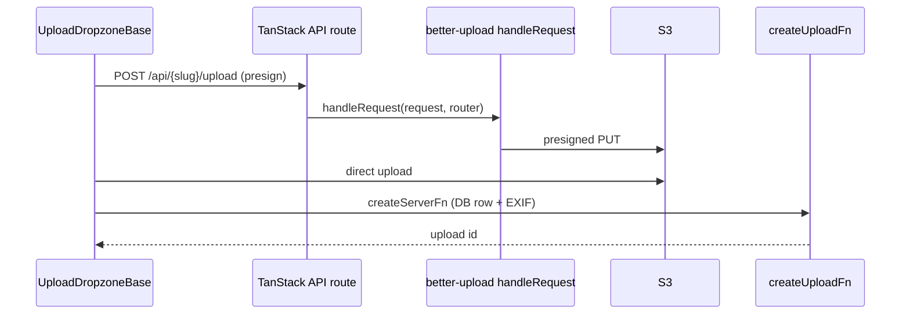

# Upload migration: `@better-upload` on TanStack Start

Analysis date: 2026-06-05  
Reference: [`tilda-geo/app`](../../tilda-geo/app) (TanStack Start patterns — **not** better-upload)  
Source: Trassenscout `src/server/uploads/`, `src/app/api/**/upload*`, dropzone components  
Docs: [better-upload llms-full.txt](https://better-upload.com/llms-full.txt) · skill `tanstack-start-conventions`

Related: [`routes.md`](./routes.md), [`images.md`](./images.md), [`auth.md`](./auth.md), [`tech-stack-migration.md`](./tech-stack-migration.md)

---

## Executive summary

| Topic                      | Trassenscout today                                | Better-upload docs (TanStack Start) | Target                                                          |
| -------------------------- | ------------------------------------------------- | ----------------------------------- | --------------------------------------------------------------- |
| Presign / multipart API    | Next `route.ts` + `toRouteHandler` (Next adapter) | `createFileRoute` + `handleRequest` | **Switch adapter** — keep packages                              |
| Post-upload DB writes      | Blitz `resolver` + `useMutation`                  | N/A (app code)                      | `createServerFn` in `uploads.functions.ts` + TanStack Query     |
| S3 read proxy (thumbnails) | Next `GET` + `getObject`                          | Same helpers                        | TanStack `server.handlers.GET`                                  |
| TILDA                      | Admin dataset URLs, no user dropzone              | —                                   | **Do not** replace TS product uploads with TILDA’s upload model |

**Decision:** Keep `@better-upload/client` and `@better-upload/server` (v3.0.14+). TILDA does not use better-upload; its `uploads.functions.ts` only covers region dataset CRUD. Trassenscout’s presigned dropzone flow stays product-specific.

**Required change from docs:** Stop using `@better-upload/server/adapters/next` (`toRouteHandler`). Use `handleRequest` from `@better-upload/server` inside TanStack Start `server.handlers.POST`, per [official quickstart](https://better-upload.com/docs/quickstart).

**Do not** move presign traffic to `createServerFn` — the client hooks POST to a URL (`useUploadFiles({ api, route })`). Server functions are for **after** S3 upload completes (`createUpload`, `createSurveyUploadPublic`, `createSupportDocument`).

---

## Better-upload vs TanStack Start (doc review)

Better Upload is framework-agnostic and documents TanStack Start explicitly. Relevant deltas from our Next.js setup:

| Better-upload guidance                                                        | Trassenscout today                         | Action                                                                                    |
| ----------------------------------------------------------------------------- | ------------------------------------------ | ----------------------------------------------------------------------------------------- |
| TanStack route: `handleRequest(request, router)`                              | `toRouteHandler(router).POST(request)`     | **Migrate** all POST upload routes                                                        |
| Route file: `createFileRoute('/api/...')({ server: { handlers: { POST } } })` | `export const POST = …` in App Router      | **Migrate** per [`routes.md`](./routes.md) table                                          |
| Client: `useUploadFiles({ route: 'upload', api: '/api/upload' })`             | Same pattern, project-specific `api` paths | **Keep** — update paths only if URLs change                                               |
| Optional: TanStack Query + `uploadFiles()`                                    | Blitz `useMutation` after upload           | **Optional** — can keep hook + `useUploadFiles`; mutations → Query                        |
| S3 helpers: `getObject`, `deleteObject`, `presignGetObject`                   | Used in routes and server code             | **Keep** — import from `@better-upload/server/helpers` in `*.server.ts` or handler bodies |
| `onBeforeUpload` / dynamic `generateObjectInfo`                               | `createUploadRouter`, survey router        | **Keep** logic — only transport layer changes                                             |

No package replacement required. Pin `@better-upload/client` and `@better-upload/server` together (already 3.0.14).

---

## Architecture (two phases per file)



1. **HTTP API route** — better-upload owns presign, validation, and S3 keys (`onBeforeUpload`).
2. **Server function** — app owns Prisma record, auth, EXIF, log entries, M2M relations.

TILDA’s phase 1 is different: external URLs + `db.upload` for map layers, ingested via `/api/uploads/create` (API key), not browser dropzones.

---

## Trassenscout inventory

### Packages & shared server code

| Path                                                        | Role                                                |
| ----------------------------------------------------------- | --------------------------------------------------- |
| `src/server/uploads/_utils/client.ts`                       | `aws()` client from `@better-upload/server/clients` |
| `src/server/uploads/_utils/createUploadRouter.ts`           | Shared `Router` factory (`route: "upload"`)         |
| `src/server/uploads/_utils/config.ts`                       | Bucket, max size, max files                         |
| `src/server/uploads/_utils/keys.ts`, `url.ts`, `sources.ts` | Key sanitization, URL helpers, metadata             |
| `.cursor/rules/uploads.mdc`                                 | Points to better-upload llms-full.txt               |

### API routes (better-upload POST)

| URL                                  | Next file                                      | TanStack target                   | Auth                    |
| ------------------------------------ | ---------------------------------------------- | --------------------------------- | ----------------------- |
| `POST /api/:projectSlug/upload`      | `api/(auth)/[projectSlug]/upload/route.ts`     | `api/$projectSlug.upload.ts`      | Project editor          |
| `POST /api/survey-upload`            | `api/(public)/survey-upload/route.ts`          | `api/survey-upload.ts`            | Survey session metadata |
| `POST /api/support/documents/upload` | `api/(auth)/support/documents/upload/route.ts` | `api/support.documents.upload.ts` | Admin                   |

### API routes (S3 proxy GET — helpers only)

| URL                                         | Next file                                       | TanStack target                           |
| ------------------------------------------- | ----------------------------------------------- | ----------------------------------------- |
| `GET /api/:projectSlug/uploads/:uploadId/*` | `.../uploads/[uploadId]/[...rest]/route.ts`     | `api/$projectSlug.uploads.$uploadId.$.ts` |
| `GET /api/support/documents/:documentId/*`  | `.../documents/[documentId]/[...rest]/route.ts` | `api/support.documents.$documentId.$.ts`  |

See [`images.md`](./images.md) for thumbnail URL strategy (drop presigned preview URLs; keep auth proxy).

### Client components (unchanged contract)

| Component               | `api` prop                      | Post-upload mutation                                          |
| ----------------------- | ------------------------------- | ------------------------------------------------------------- |
| `UploadDropzone`        | `/api/${projectSlug}/upload`    | `createUpload` → **`createUploadFn`**                         |
| `SurveyUploadDropzone`  | `/api/survey-upload`            | `createSurveyUploadPublic` → **`createSurveyUploadPublicFn`** |
| `SupportUploadDropzone` | `/api/support/documents/upload` | `createSupportDocument` → **`createSupportDocumentFn`**       |
| `UploadDropzoneBase`    | (prop)                          | `useUploadFiles({ route: "upload", api })`                    |

### Server mutations (→ `*.functions.ts`, not better-upload)

| Blitz mutation                                                                   | Target                                                                          |
| -------------------------------------------------------------------------------- | ------------------------------------------------------------------------------- |
| `createUpload`                                                                   | `createUploadFn` in `src/server/uploads/uploads.functions.ts`                   |
| `createSurveyUploadPublic`                                                       | `createSurveyUploadPublicFn`                                                    |
| `createSupportDocument`                                                          | `src/server/supportDocuments/supportDocuments.functions.ts` (or uploads domain) |
| `deleteUploadFileAndDbRecord`, `getPresignedUploadUrl`, `copyToLuckyCloud`, etc. | Stay in `*.server.ts`; expose via `*Fn` only where UI calls them                |

### Other S3 usage (no better-upload route)

- Email attachment pipeline (`process-project-record-email`) — `putObject` / helpers directly.
- `fetchPdfFromS3`, summarize upload — `getObject` in server-only code.

---

## TanStack Start conventions (FMC)

Follow `tanstack-start-conventions` — summary for uploads:

| Rule                                                               | Upload application                                                                                              |
| ------------------------------------------------------------------ | --------------------------------------------------------------------------------------------------------------- |
| Presign endpoints                                                  | **`src/routes/api/*.ts`** with `server.handlers` — **not** `createServerFn`                                     |
| No `import '@tanstack/react-start/server-only'` on API route files | Route modules are imported by `routeTree.gen.ts` on client; auth/S3 only inside handlers                        |
| Auth in handlers                                                   | `getRequestHeaders()` + Better Auth session; project guards like TILDA `guardRegionMembership`                  |
| Path params                                                        | Zod `params.parse` on UI routes; API routes: Zod `safeParse` on `params` in `GET`/`POST` with explicit 4xx JSON |
| API search params                                                  | No `validateSearch` on API routes — parse `request.url` in handler if needed                                    |
| DB / S3 helpers                                                    | `src/server/uploads/**/*.server.ts` — imported only from handlers or `*.functions.ts` handlers                  |
| Callable from UI                                                   | `uploads.functions.ts` — `createUploadFn`, etc.                                                                 |
| `ssr` on API routes                                                | Set explicitly (`ssr: true` is fine; handlers always run server-side)                                           |

---

## Target API route pattern

Replace Next `toRouteHandler` with documented TanStack Start shape. Shared router factory stays in `src/server/uploads/_utils/createUploadRouter.ts` (or rename to `createUploadRouter.server.ts` if imported outside handlers).

### Project upload (authenticated)

```ts
// src/routes/api/$projectSlug.upload.ts
import { createFileRoute } from "@tanstack/react-router"
import { handleRequest } from "@better-upload/server"
import { z } from "zod"
import { isSupportedMimeType } from "@/components/.../getFileType"
import { createUploadRouter } from "@/server/uploads/_utils/createUploadRouter"
import { guardProjectEditor } from "@/server/api/util/authGuards.server" // new or ported

const paramsSchema = z.object({ projectSlug: z.string().min(1) })

export const Route = createFileRoute("/api/$projectSlug/upload")({
  ssr: true,
  params: {
    parse: (raw) => paramsSchema.parse(raw),
  },
  server: {
    handlers: {
      POST: async ({ request, params }) => {
        const auth = await guardProjectEditor({
          headers: request.headers,
          projectSlug: params.projectSlug,
        })
        if (auth) return auth

        try {
          const router = createUploadRouter({
            keyPrefix: params.projectSlug,
            userId: auth.userId,
            onBeforeUpload: async (files) => {
              for (const file of files) {
                if (!isSupportedMimeType(file.type)) {
                  throw new Error(`Dateityp nicht erlaubt: ${file.type || "unbekannt"}. …`)
                }
              }
            },
          })
          return handleRequest(request, router)
        } catch (error) {
          console.error("Upload route error:", error)
          return Response.json(
            { error: error instanceof Error ? error.message : "Internal server error" },
            { status: 500, headers: { "Content-Type": "application/json" } },
          )
        }
      },
    },
  },
})
```

### Public survey upload

Port logic from `survey-upload/route.ts` verbatim into `api/survey-upload.ts`:

- Inline `Router` (or extract `createSurveyUploadRouter.server.ts` to dedupe with project router).
- `clientMetadata` for `surveyResponseId` / `surveySessionId`.
- **No** session cookie — keep metadata + DB verification in `onBeforeUpload`.

### Support documents upload

Port `withAdminAuth` → `guardAdmin` (Better Auth) + `createUploadRouter({ keyPrefix: 'support', userId })` + `handleRequest`.

### S3 proxy GET

No better-upload route helper — standard handler:

```ts
GET: async ({ request, params }) => {
  const auth = await guardProjectViewer({
    headers: request.headers,
    projectSlug: params.projectSlug,
  })
  if (auth) return auth
  // … load upload row, getObject, return Response(blob)
}
```

Use Zod on `uploadId` (coerce number). Splat `.$` file for filename segment ([`routes.md`](./routes.md)).

---

## Server functions (post-upload)

After better-upload completes, the dropzone calls `createUploadRecord`. Migrate Blitz resolvers to:

```ts
// src/server/uploads/uploads.functions.ts
import { createServerFn } from "@tanstack/react-start"
import { getRequestHeaders } from "@tanstack/react-start/server"
import { z } from "zod"
import { createUpload } from "./mutations/createUpload.server"

const CreateUploadInput = z.object({
  /* former UploadSchema + projectSlug */
})

export const createUploadFn = createServerFn({ method: "POST" })
  .inputValidator((data: unknown) => CreateUploadInput.parse(data))
  .handler(async ({ data }) => {
    return createUpload(data, getRequestHeaders())
  })
```

**UI:**

```tsx
import { useMutation } from "@tanstack/react-query"
import { createUploadFn } from "@/server/uploads/uploads.functions"

const mutation = useMutation({
  mutationFn: (input: CreateUploadInput) => createUploadFn({ data: input }),
})
```

Move authorization from Blitz `authorizeProjectMember` into `createUpload.server.ts` using headers (same pattern as TILDA `getUploadsForRegionUserFn`).

**Do not** call `handleRequest` from `createServerFn` — wrong protocol; client would not use presigned flow.

---

## Client (`@better-upload/client`)

No doc changes required for TanStack Start beyond stable API URLs:

```tsx
const uploader = useUploadFiles({
  route: "upload", // must match router.routes key in createUploadRouter
  api: `/api/${projectSlug}/upload`,
  onError: (error) => {
    /* keep errorMessageTranslations */
  },
  onUploadComplete: async ({ files }) => {
    /* createUploadFn per file */
  },
})
```

Optional later: [TanStack Query guide](https://better-upload.com/docs/guides/tanstack-query) with `uploadFiles()` + `useMutation` instead of `useUploadFiles` — not required for migration.

---

## Auth wrapper migration

| Next wrapper                            | Target                                                                                                                                |
| --------------------------------------- | ------------------------------------------------------------------------------------------------------------------------------------- |
| `withProjectMembership(roles, handler)` | `guardProjectMembership` / `guardProjectEditor` in `src/server/api/util/authGuards.server.ts` — returns `Response` or `{ userId, … }` |
| `withAdminAuth`                         | `guardAdmin`                                                                                                                          |
| Public survey route                     | No cookie; validate `clientMetadata` + DB in `onBeforeUpload`                                                                         |

Pass `request.headers` into Better Auth `auth.api.getSession({ headers })` (see [`auth.md`](./auth.md)).

---

## TILDA reference (what not to copy)

| TILDA                                                              | Trassenscout                                             |
| ------------------------------------------------------------------ | -------------------------------------------------------- |
| `routes/api/uploads.create.ts` — API key, JSON body, no S3 presign | User/browser uploads via better-upload                   |
| `routes/api/uploads.$slug.ts` — dataset proxy (PMTiles, GeoJSON)   | Project file proxy under `/api/$projectSlug/uploads/...` |
| `uploads.functions.ts` — list/delete region datasets               | Project upload CRUD + dropzone                           |
| No `@better-upload` dependency                                     | Keep better-upload                                       |

Reuse from TILDA: **file naming** for API routes, **auth guard style**, **explicit `ssr`**, not the upload product model.

---

## Migration phases

### Phase 1 — API transport

- [ ] Add TanStack API routes for all three POST upload endpoints using `handleRequest`
- [ ] Port GET proxy routes (`getObject`)
- [ ] Remove `@better-upload/server/adapters/next` imports from codebase
- [ ] Port `withProjectMembership` / `withAdminAuth` to `authGuards.server.ts`
- [ ] Verify `route: "upload"` still matches `createUploadRouter.routes.upload`

### Phase 2 — Server functions & UI

- [ ] `createUpload.server.ts` + `createUploadFn`
- [ ] `createSurveyUploadPublicFn`, `createSupportDocumentFn`
- [ ] Replace `@blitzjs/rpc` `useMutation` in dropzone components with TanStack Query
- [ ] Colocate or move components under `src/components/...` (no `src/app/`)

### Phase 3 — Cleanup & images

- [ ] Drop `withUploadPreviewUrl` / presigned list previews ([`images.md`](./images.md))
- [ ] Deduplicate survey vs project router if desired (`createSurveyUploadRouter.server.ts`)
- [ ] knip: ensure no remaining `adapters/next` imports

Upload-specific tests (dropzone E2E, S3 integration) are out of scope for the platform migration.

---

## Decision log

| Topic                               | Decision                 | Rationale                                                                 |
| ----------------------------------- | ------------------------ | ------------------------------------------------------------------------- |
| Keep `@better-upload`               | Yes                      | Product already built on presigned dropzones; docs support TanStack Start |
| `handleRequest` vs `toRouteHandler` | `handleRequest`          | Official TanStack Start path; avoids Next adapter on Nitro                |
| Presign via `createServerFn`        | No                       | Client library expects HTTP POST to `api` URL                             |
| Post-upload via `createServerFn`    | Yes                      | FMC convention; replaces Blitz RPC                                        |
| Rewrite to TILDA presign            | No                       | Different product; optional only if dropping better-upload later          |
| `createUploadRouter` location       | `_utils` or `.server.ts` | Only consumed from API handlers + tests                                   |

---

## File mapping

| Current (Next / Blitz)                                                   | Target                                                      |
| ------------------------------------------------------------------------ | ----------------------------------------------------------- |
| `src/app/api/(auth)/[projectSlug]/upload/route.ts`                       | `src/routes/api/$projectSlug.upload.ts`                     |
| `src/app/api/(public)/survey-upload/route.ts`                            | `src/routes/api/survey-upload.ts`                           |
| `src/app/api/(auth)/support/documents/upload/route.ts`                   | `src/routes/api/support.documents.upload.ts`                |
| `src/app/api/(auth)/[projectSlug]/uploads/[uploadId]/[...rest]/route.ts` | `src/routes/api/$projectSlug.uploads.$uploadId.$.ts`        |
| `src/app/api/(auth)/support/documents/[documentId]/[...rest]/route.ts`   | `src/routes/api/support.documents.$documentId.$.ts`         |
| `src/server/uploads/mutations/createUpload.ts`                           | `mutations/createUpload.server.ts` + `uploads.functions.ts` |
| `UploadDropzone.tsx` (Blitz mutation)                                    | TanStack Query + `createUploadFn`                           |
| `src/server/uploads/_utils/createUploadRouter.ts`                        | Keep; optional `.server.ts` suffix                          |

---

## References

- Better Upload: https://better-upload.com/llms-full.txt · https://better-upload.com/docs/quickstart
- TanStack Start server routes: https://tanstack.com/start/latest/docs/framework/react/guide/server-routes
- Repo: `.cursor/rules/uploads.mdc`
- Routes table: [`routes.md`](./routes.md#api-routes)
- Images / proxy: [`images.md`](./images.md)
