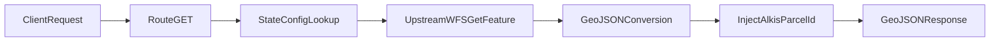

# ALKIS WFS Proxy

This endpoint proxies parcel requests to the configured state ALKIS WFS and always returns GeoJSON.
It validates inputs, fetches from the upstream WFS, converts the payload when needed, and injects normalized parcel IDs for downstream selection/storage.

## Endpoint

- Method: `GET`
- Path: `/api/[projectSlug]/alkis-wfs-parcels`
- Runtime: Node.js (`ogr2ogr` is required)
- Auth: project membership (viewer roles)

## Query Parameters

- `bbox` (required): `west,south,east,north` in `EPSG:4326`
- `count` (optional): max features, default `1000`, allowed range `1..10000`

## Response

- `200 OK` with `Content-Type: application/json`
- Body is always a GeoJSON `FeatureCollection`
- Every feature is enriched with:
  - `properties.alkisParcelId`
  - `properties.alkisParcelIdSource`

## Request Flow

## Output Formats and GeoJSON Handling

The proxy supports mixed upstream formats and normalizes them into a GeoJSON `FeatureCollection`.

1. JSON fast path:
   - If the upstream body is already valid GeoJSON `FeatureCollection`, it is returned directly after validation.
   - No GDAL conversion is executed.
2. GDAL fallback:
   - If JSON parsing/shape validation fails (typically GML/XML responses), the payload is written to a temp file.
   - `ogr2ogr` converts it to GeoJSON using:
     - `ogr2ogr -f GeoJSON /vsistdout/ <tmp> -t_srs EPSG:4326`
   - Input format is auto-detected by GDAL.
   - Temp files are removed in `finally`.

Default requested WFS output format is GML (`text/xml; subtype=gml/3.2.1`) unless overridden per state.

States currently configured for direct JSON output:

- Baden-Wuerttemberg (`application/json`)
- Berlin (`application/json`)
- Rheinland-Pfalz (`application/json; subtype=geojson`)

## Which ALKIS Data Becomes GeoJSON

Per project, the proxy uses `project.alkisStateKey` and reads state-specific config from:

- `src/app/api/(auth)/[projectSlug]/alkis-wfs-parcels/_utils/alkisStateConfig.ts`

For that state, it builds a `GetFeature` request from:

- `wfsUrl`: upstream WFS endpoint
- `parcelPropertyKey`: WFS `TYPENAMES` value (parcel feature type)
- `bboxAxisOrder`: whether `BBOX` is sent as `lon,lat` or `lat,lon`
- `wfsOutputFormat`: requested `OUTPUTFORMAT` (or default GML)

The returned parcel features (geometry + original properties) are then normalized and returned as GeoJSON.

## alkisParcelId Creation and Normalization

`alkisParcelId` is resolved per feature using this fallback order:

1. `properties[config.alkisParcelIdPropertyKey]` (state-specific preferred source)
2. `properties.flurstueckskennzeichen`
3. `properties.gml_id`
4. `feature.id`
5. `null` (no usable ID found)

The proxy injects both fields into every feature:

- `alkisParcelId`: resolved identifier (string or `null`)
- `alkisParcelIdSource`: source key (`<configuredKey>`, `flurstueckskennzeichen`, `gml_id`, `feature.id`, or `none`)

This follows the normalization strategy from the Flurstueckskennzeichen ID plan and ensures stable IDs even when upstream states differ by format/property naming.

## Error Semantics

- `400`: invalid/missing `bbox`, invalid `count`, ALKIS disabled/unconfigured for project
- `404`: project not found
- `501`: state does not support direct `EPSG:4326` BBOX (reprojection not implemented)
- `502`: upstream WFS HTTP failure or OGC `ExceptionReport`
- `504`: upstream timeout after 30 seconds
- `500`: conversion/normalization failures (invalid JSON, ogr2ogr conversion issues)
